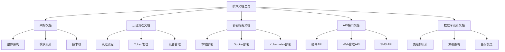
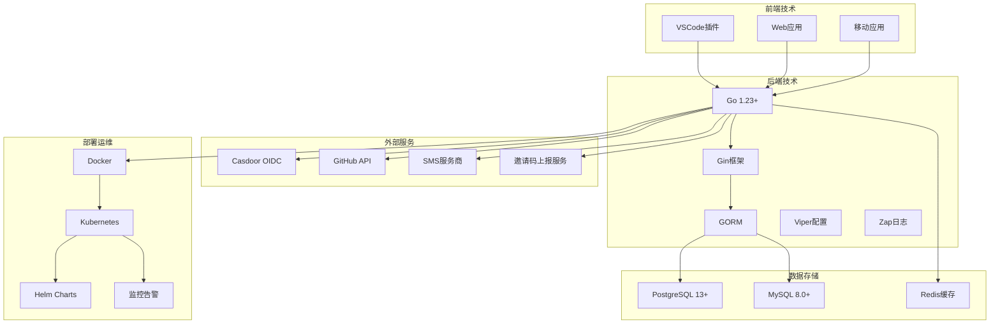

# OIDC认证服务技术文档

## 文档概述

本目录包含了OIDC认证服务的完整技术文档，涵盖架构设计、认证流程、部署指南、API接口和数据库设计等各个方面。

## 文档结构



## 快速导航

### 📋 [架构文档](./architecture.md)
- **目标读者**: 架构师、技术负责人
- **内容概要**: 系统整体架构、模块设计、技术选型
- **关键图表**: 
  - 整体架构图
  - 模块依赖图
  - 部署架构图

### 🔐 [认证流程文档](./authentication-flow.md)
- **目标读者**: 开发工程师、集成工程师
- **内容概要**: OIDC认证流程、Token管理、设备管理
- **关键图表**:
  - 认证时序图
  - Token生命周期图
  - 设备管理流程图

### 🚀 [部署指南文档](./deployment-guide.md)
- **目标读者**: 运维工程师、DevOps工程师
- **内容概要**: 本地开发、Docker部署、Kubernetes生产部署
- **关键图表**:
  - 部署架构图
  - 高可用配置图
  - 监控架构图

### 📡 [API接口文档](./api-reference.md)
- **目标读者**: 前端开发者、客户端开发者
- **内容概要**: 完整API接口说明、SDK示例、测试用例
- **关键图表**:
  - API架构图
  - 调用流程图

### 🗄️ [数据库设计文档](./database-design.md)
- **目标读者**: 数据库管理员、后端开发者
- **内容概要**: 表结构设计、索引策略、备份恢复
- **关键图表**:
  - 数据库ER图
  - 备份架构图

## 项目核心特性

### 🔑 认证特性
- **标准OIDC协议**: 完全兼容OpenID Connect 1.0规范
- **多平台支持**: VSCode插件、Web应用、移动应用
- **设备管理**: 支持多设备登录和管理
- **Token安全**: 哈希存储、定期刷新、安全撤销
- **邀请码系统**: 支持邀请码生成、使用和上报功能

### 🌟 GitHub集成
- **Star同步**: 自动同步GitHub仓库Star状态
- **VIP管理**: 基于Star状态的用户等级管理
- **分布式锁**: 多实例环境下的同步冲突防护

### 📱 SMS服务
- **验证码发送**: 支持多种SMS服务商
- **模板管理**: 可配置的短信模板
- **测试模式**: 开发环境友好的测试模式

### 🛡️ 安全特性
- **数据加密**: AES/RSA双重加密保护
- **安全头**: 完整的HTTP安全头设置
- **请求日志**: 详细的请求链路追踪
- **权限控制**: 细粒度的访问权限管理

### 🎫 邀请码功能
- **邀请码生成**: 8位随机邀请码生成
- **使用验证**: 严格的邀请码使用规则验证
- **事件上报**: 异步上报邀请码使用事件到外部服务
- **状态管理**: 完整的邀请码使用状态追踪

## 技术栈总览



## 开发指南

### 环境搭建

1. **克隆项目**
   ```bash
   git clone https://github.com/zgsm-ai/oidc-auth.git
   cd oidc-auth
   ```

2. **安装依赖**
   ```bash
   go mod tidy
   ```

3. **配置环境**
   ```bash
   cp config/config.yaml config/config.local.yaml
   # 编辑配置文件
   ```

4. **启动服务**
   ```bash
   go run cmd/main.go serve --config config/config.local.yaml
   ```

### 代码结构

```
internal/
├── config/         # 配置管理
├── constants/      # 常量定义
├── handler/        # HTTP处理器
├── middleware/     # 中间件
├── providers/      # OAuth提供商
├── repository/     # 数据访问层
├── service/        # 业务服务层
└── sync/          # GitHub同步服务
```

### 开发规范

- **代码风格**: 遵循Go官方代码规范
- **错误处理**: 使用标准错误处理模式
- **日志记录**: 使用结构化日志
- **测试覆盖**: 单元测试覆盖率 > 80%

## 运维指南

### 监控指标

- **应用指标**: QPS、响应时间、错误率
- **系统指标**: CPU、内存、磁盘、网络
- **业务指标**: 认证成功率、用户活跃度、设备数量、邀请码使用率

### 告警规则

- 认证失败率 > 5%
- 平均响应时间 > 2秒
- 数据库连接数 > 80%
- GitHub同步失败
- 邀请码上报失败

### 故障处理

1. **服务不可用**: 检查Pod状态、资源使用情况
2. **认证失败**: 检查Casdoor服务、网络连通性
3. **数据库异常**: 检查连接池、慢查询
4. **同步异常**: 检查GitHub API限制、Token有效性
5. **邀请码异常**: 检查上报服务配置、网络连通性

## 版本历史

| 版本 | 发布日期 | 主要变更 |
|------|----------|----------|
| v1.0.0 | 2024-01-01 | 初始版本发布 |
| v1.1.0 | 2024-02-01 | 添加GitHub Star同步 |
| v1.2.0 | 2024-03-01 | 增强设备管理功能 |
| v1.3.0 | 2024-04-01 | 优化性能和安全性 |
| v1.4.0 | 2024-05-01 | 新增邀请码功能 |

## 贡献指南

### 文档贡献

1. **Fork项目**: 创建项目分支
2. **编辑文档**: 使用Markdown格式
3. **添加图表**: 使用Mermaid语法
4. **提交PR**: 详细描述变更内容

### 文档规范

- **格式**: 使用Markdown格式
- **图表**: 使用Mermaid.js绘制
- **代码**: 提供完整可运行的示例
- **链接**: 使用相对路径链接

## 联系方式

- **项目地址**: https://github.com/zgsm-ai/oidc-auth
- **问题反馈**: https://github.com/zgsm-ai/oidc-auth/issues
- **技术讨论**: https://github.com/zgsm-ai/oidc-auth/discussions

---

*最后更新时间: 2024-01-01*
*文档版本: v1.0.0*