# OIDC认证服务API接口文档

## 概述

本文档详细描述了OIDC认证服务提供的所有API接口，包括认证、用户管理、SMS服务等功能。

## API架构图

```mermaid
graph TB
    subgraph "API网关层"
        A[Nginx/负载均衡器]
    end
    
    subgraph "认证中间件"
        B[安全头中间件]
        C[请求日志中间件]
        D[平台识别中间件]
    end
    
    subgraph "API路由组"
        E[插件认证API]
        F[Web管理API]
        G[SMS服务API]
        H[健康检查API]
    end
    
    subgraph "业务处理层"
        I[认证处理器]
        J[用户管理器]
        K[Token管理器]
        L[SMS处理器]
    end
    
    A --> B
    B --> C
    C --> D
    D --> E
    D --> F
    D --> G
    D --> H
    E --> I
    F --> J
    G --> L
    H --> I
    I --> K
```



## 基础信息

### 服务地址
- **开发环境**: `http://localhost:8080`
- **测试环境**: `https://test-auth.yourdomain.com`
- **生产环境**: `https://auth.yourdomain.com`

### 通用响应格式

```json
{
  "code": 200,
  "message": "success",
  "data": {},
  "timestamp": "2024-01-01T00:00:00Z"
}
```

### 错误响应格式

```json
{
  "code": 400,
  "message": "Bad Request",
  "error": "详细错误信息",
  "timestamp": "2024-01-01T00:00:00Z"
}
```

## 插件认证API

### 1. 发起登录

```http
GET /oidc-auth/api/v1/plugin/login
```

#### 请求参数

| 参数名 | 类型 | 必填 | 描述 |
|--------|------|------|------|
| state | string | 是 | 防CSRF攻击的随机字符串 |
| machine_code | string | 是 | 设备唯一标识码 |
| uri_scheme | string | 否 | 回调URI方案 |
| plugin_version | string | 否 | 插件版本号 |
| vscode_version | string | 否 | VSCode版本号 |
| invite_code | string | 否 | 邀请码（8位字符串） |

#### 请求示例

```bash
curl -X GET "https://auth.yourdomain.com/oidc-auth/api/v1/plugin/login?state=abc123&machine_code=device001&uri_scheme=vscode&plugin_version=1.0.0&vscode_version=1.85.0&invite_code=ABC12345"
```

#### 响应

```http
HTTP/1.1 302 Found
Location: https://casdoor.yourdomain.com/login/oauth/authorize?client_id=xxx&redirect_uri=xxx&state=abc123
```

### 2. 登录回调

```http
GET /oidc-auth/api/v1/plugin/login/callback
```

#### 请求参数

| 参数名 | 类型 | 必填 | 描述 |
|--------|------|------|------|
| code | string | 是 | OAuth授权码 |
| state | string | 是 | 状态参数，需与登录时一致 |

#### 响应示例

```json
{
  "code": 200,
  "message": "登录成功",
  "data": {
    "token_hash": "abc123def456",
    "user_info": {
      "id": "user-uuid",
      "name": "张三",
      "email": "zhangsan@example.com",
      "github_id": "12345",
      "vip": 1
    },
    "expires_at": "2024-01-01T01:00:00Z"
  }
}
```

### 3. 获取Token

```http
GET /oidc-auth/api/v1/plugin/login/token
```

#### 请求头

```http
Authorization: Bearer {token_hash}
```

#### 响应示例

```json
{
  "code": 200,
  "message": "success",
  "data": {
    "access_token": "eyJhbGciOiJIUzI1NiIs...",
    "token_type": "Bearer",
    "expires_in": 3600,
    "refresh_token": "refresh_token_here",
    "scope": "read write"
  }
}
```

### 4. 登出

```http
GET /oidc-auth/api/v1/plugin/login/logout
```

#### 请求头

```http
Authorization: Bearer {token_hash}
```

#### 响应示例

```json
{
  "code": 200,
  "message": "登出成功"
}
```

### 5. 登录状态检查

```http
GET /oidc-auth/api/v1/plugin/login/status
```

#### 请求头

```http
Authorization: Bearer {token_hash}
```

#### 响应示例

```json
{
  "code": 200,
  "message": "success",
  "data": {
    "status": "active",
    "user_id": "user-uuid",
    "expires_at": "2024-01-01T01:00:00Z",
    "device_info": {
      "machine_code": "device001",
      "vscode_version": "1.85.0",
      "plugin_version": "1.0.0"
    }
  }
}
```

## Web管理API

### 1. 通过Hash获取Token

```http
GET /oidc-auth/api/v1/manager/token
```

#### 请求参数

| 参数名 | 类型 | 必填 | 描述 |
|--------|------|------|------|
| hash | string | 是 | Token哈希值 |

#### 请求示例

```bash
curl -X GET "https://auth.yourdomain.com/oidc-auth/api/v1/manager/token?hash=abc123def456"
```

#### 响应示例

```json
{
  "code": 200,
  "message": "success",
  "data": {
    "access_token": "eyJhbGciOiJIUzI1NiIs...",
    "user_info": {
      "id": "user-uuid",
      "name": "张三",
      "email": "zhangsan@example.com"
    }
  }
}
```

### 2. 绑定账户

```http
GET /oidc-auth/api/v1/manager/bind/account
```

#### 请求参数

| 参数名 | 类型 | 必填 | 描述 |
|--------|------|------|------|
| state | string | 是 | 状态参数 |
| redirect_uri | string | 否 | 回调地址 |

#### 响应

```http
HTTP/1.1 302 Found
Location: https://casdoor.yourdomain.com/login/oauth/authorize?client_id=xxx&redirect_uri=xxx&state=abc123
```

### 3. 绑定账户回调

```http
GET /oidc-auth/api/v1/manager/bind/account/callback
```

#### 请求参数

| 参数名 | 类型 | 必填 | 描述 |
|--------|------|------|------|
| code | string | 是 | OAuth授权码 |
| state | string | 是 | 状态参数 |

#### 响应示例

```json
{
  "code": 200,
  "message": "账户绑定成功",
  "data": {
    "user_id": "user-uuid",
    "bind_status": "success"
  }
}
```

### 4. 获取用户信息

```http
GET /oidc-auth/api/v1/manager/userinfo
```

#### 请求头

```http
Authorization: Bearer {access_token}
```

#### 响应示例

```json
{
  "code": 200,
  "message": "success",
  "data": {
    "id": "user-uuid",
    "name": "张三",
    "email": "zhangsan@example.com",
    "github_id": "12345",
    "github_name": "zhangsan",
    "vip": 1,
    "phone": "+86138****8888",
    "company": "示例公司",
    "location": "北京",
    "github_star": "zgsm-ai.oidc-auth",
    "devices": [
      {
        "id": "device-uuid",
        "machine_code": "device001",
        "vscode_version": "1.85.0",
        "plugin_version": "1.0.0",
        "status": "active",
        "created_at": "2024-01-01T00:00:00Z"
      }
    ],
    "access_time": "2024-01-01T00:00:00Z"
  }
}
```

## SMS服务API

### 发送短信验证码

```http
POST /oidc-auth/api/v1/send/sms
```

#### 请求体

```json
{
  "phone": "+86138****8888",
  "template_id": "SMS_001",
  "params": {
    "code": "123456"
  }
}
```

#### 请求示例

```bash
curl -X POST "https://auth.yourdomain.com/oidc-auth/api/v1/send/sms" \
  -H "Content-Type: application/json" \
  -d '{
    "phone": "+86138****8888",
    "template_id": "SMS_001",
    "params": {
      "code": "123456"
    }
  }'
```

#### 响应示例

```json
{
  "code": 200,
  "message": "短信发送成功",
  "data": {
    "message_id": "msg_123456",
    "status": "sent",
    "phone": "+86138****8888"
  }
}
```

## 健康检查API

### 就绪检查

```http
GET /health/ready
```

#### 响应示例

```json
{
  "status": "ready",
  "timestamp": "2024-01-01T00:00:00Z",
  "checks": {
    "database": "ok",
    "casdoor": "ok",
    "github": "ok"
  }
}
```

## 错误码说明

### HTTP状态码

| 状态码 | 描述 | 说明 |
|--------|------|------|
| 200 | OK | 请求成功 |
| 400 | Bad Request | 请求参数错误 |
| 401 | Unauthorized | 未授权或Token无效 |
| 403 | Forbidden | 权限不足 |
| 404 | Not Found | 资源不存在 |
| 500 | Internal Server Error | 服务器内部错误 |
| 502 | Bad Gateway | 上游服务错误 |
| 503 | Service Unavailable | 服务不可用 |

### 业务错误码

| 错误码 | 描述 | 解决方案 |
|--------|------|----------|
| 10001 | 参数验证失败 | 检查请求参数格式 |
| 10002 | State参数无效 | 重新发起认证流程 |
| 10003 | 授权码无效 | 检查OAuth流程 |
| 10004 | Token已过期 | 使用刷新Token或重新登录 |
| 10005 | 用户不存在 | 检查用户信息 |
| 10006 | 设备未注册 | 重新注册设备 |
| 20001 | 数据库连接失败 | 检查数据库状态 |
| 20002 | Casdoor服务异常 | 检查Casdoor服务 |
| 20003 | GitHub API异常 | 检查GitHub服务 |
| 20004 | SMS服务异常 | 检查SMS服务配置 |

## API调用流程图

### 插件认证流程


### Web管理流程


## SDK示例

### JavaScript/TypeScript

```typescript
class OIDCAuthClient {
  private baseURL: string;
  private tokenHash?: string;

  constructor(baseURL: string) {
    this.baseURL = baseURL;
  }

  // 发起登录
  async login(params: {
    state: string;
    machineCode: string;
    uriScheme?: string;
    pluginVersion?: string;
    vscodeVersion?: string;
  }): Promise<string> {
    const url = new URL('/oidc-auth/api/v1/plugin/login', this.baseURL);
    Object.entries(params).forEach(([key, value]) => {
      if (value) url.searchParams.set(key, value);
    });
    
    // 返回重定向URL
    return url.toString();
  }

  // 获取Token
  async getToken(): Promise<TokenResponse> {
    const response = await fetch(
      `${this.baseURL}/oidc-auth/api/v1/plugin/login/token`,
      {
        headers: {
          'Authorization': `Bearer ${this.tokenHash}`
        }
      }
    );
    
    if (!response.ok) {
      throw new Error(`HTTP ${response.status}: ${response.statusText}`);
    }
    
    return response.json();
  }

  // 检查登录状态
  async checkStatus(): Promise<StatusResponse> {
    const response = await fetch(
      `${this.baseURL}/oidc-auth/api/v1/plugin/login/status`,
      {
        headers: {
          'Authorization': `Bearer ${this.tokenHash}`
        }
      }
    );
    
    return response.json();
  }

  // 登出
  async logout(): Promise<void> {
    await fetch(
      `${this.baseURL}/oidc-auth/api/v1/plugin/login/logout`,
      {
        method: 'GET',
        headers: {
          'Authorization': `Bearer ${this.tokenHash}`
        }
      }
    );
    
    this.tokenHash = undefined;
  }
}

// 使用示例
const client = new OIDCAuthClient('https://auth.yourdomain.com');

// 发起登录
const loginURL = await client.login({
  state: 'random-state-string',
  machineCode: 'device-001',
  pluginVersion: '1.0.0',
  vscodeVersion: '1.85.0'
});

// 获取Token
const tokenInfo = await client.getToken();
console.log('Access Token:', tokenInfo.data.access_token);
```

### Go

```go
package main

import (
    "encoding/json"
    "fmt"
    "net/http"
    "net/url"
)

type OIDCAuthClient struct {
    BaseURL   string
    TokenHash string
    Client    *http.Client
}

type TokenResponse struct {
    Code    int    `json:"code"`
    Message string `json:"message"`
    Data    struct {
        AccessToken  string `json:"access_token"`
        TokenType    string `json:"token_type"`
        ExpiresIn    int64  `json:"expires_in"`
        RefreshToken string `json:"refresh_token"`
    } `json:"data"`
}

func NewOIDCAuthClient(baseURL string) *OIDCAuthClient {
    return &OIDCAuthClient{
        BaseURL: baseURL,
        Client:  &http.Client{},
    }
}

func (c *OIDCAuthClient) Login(params map[string]string) string {
    u, _ := url.Parse(c.BaseURL + "/oidc-auth/api/v1/plugin/login")
    q := u.Query()
    for k, v := range params {
        q.Set(k, v)
    }
    u.RawQuery = q.Encode()
    return u.String()
}

func (c *OIDCAuthClient) GetToken() (*TokenResponse, error) {
    req, err := http.NewRequest("GET", 
        c.BaseURL+"/oidc-auth/api/v1/plugin/login/token", nil)
    if err != nil {
        return nil, err
    }
    
    req.Header.Set("Authorization", "Bearer "+c.TokenHash)
    
    resp, err := c.Client.Do(req)
    if err != nil {
        return nil, err
    }
    defer resp.Body.Close()
    
    var tokenResp TokenResponse
    if err := json.NewDecoder(resp.Body).Decode(&tokenResp); err != nil {
        return nil, err
    }
    
    return &tokenResp, nil
}

// 使用示例
func main() {
    client := NewOIDCAuthClient("https://auth.yourdomain.com")
    
    // 发起登录
    loginURL := client.Login(map[string]string{
        "state":          "random-state-string",
        "machine_code":   "device-001",
        "plugin_version": "1.0.0",
        "vscode_version": "1.85.0",
    })
    
    fmt.Println("Login URL:", loginURL)
    
    // 设置token hash (从回调中获得)
    client.TokenHash = "your-token-hash"
    
    // 获取Token
    tokenInfo, err := client.GetToken()
    if err != nil {
        panic(err)
    }
    
    fmt.Println("Access Token:", tokenInfo.Data.AccessToken)
}
```

## 测试用例

### 单元测试示例

```bash
# 测试登录接口
curl -X GET "http://localhost:8080/oidc-auth/api/v1/plugin/login?state=test123&machine_code=test-device"

# 测试健康检查
curl -X GET "http://localhost:8080/health/ready"

# 测试SMS发送
curl -X POST "http://localhost:8080/oidc-auth/api/v1/send/sms" \
  -H "Content-Type: application/json" \
  -d '{"phone": "+86138****8888", "template_id": "TEST"}'
```

### 集成测试

```bash
#!/bin/bash

# 完整认证流程测试
STATE="test-$(date +%s)"
MACHINE_CODE="test-device-001"

# 1. 发起登录
echo "1. 发起登录..."
LOGIN_RESPONSE=$(curl -s -X GET \
  "http://localhost:8080/oidc-auth/api/v1/plugin/login?state=${STATE}&machine_code=${MACHINE_CODE}")

echo "登录响应: $LOGIN_RESPONSE"

# 2. 模拟回调 (需要实际的授权码)
# echo "2. 处理回调..."
# CALLBACK_RESPONSE=$(curl -s -X GET \
#   "http://localhost:8080/oidc-auth/api/v1/plugin/login/callback?code=AUTH_CODE&state=${STATE}")

# 3. 健康检查
echo "3. 健康检查..."
HEALTH_RESPONSE=$(curl -s -X GET "http://localhost:8080/health/ready")
echo "健康检查响应: $HEALTH_RESPONSE"
```

## 版本兼容性

### API版本

| 版本 | 状态 | 支持时间 | 主要变更 |
|------|------|----------|----------|
| v1 | 当前版本 | 2024-01+ | 初始版本 |

### 向后兼容性

- 新增字段不会破坏现有客户端
- 废弃字段会保留至少6个月
- 重大变更会发布新的API版本

这个API文档提供了完整的接口说明、示例代码和测试用例，方便开发者集成和使用OIDC认证服务。