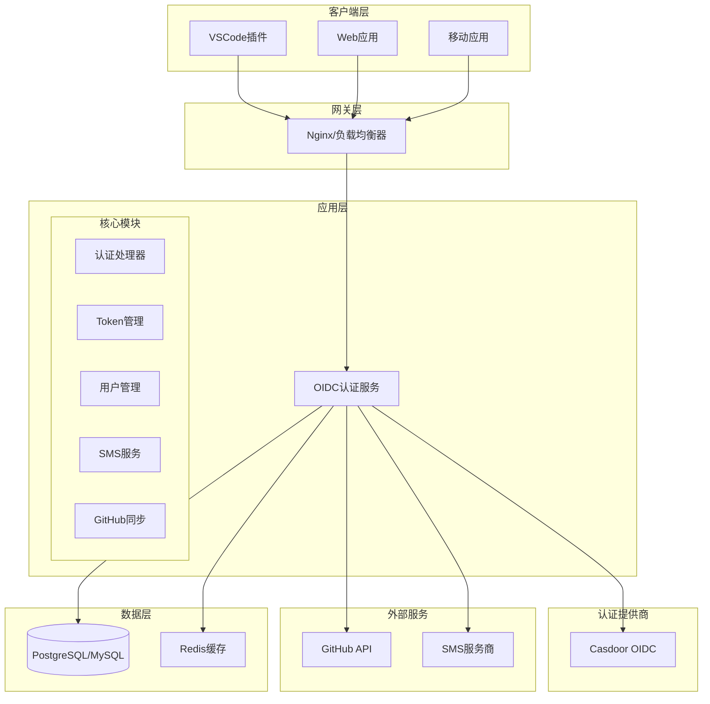
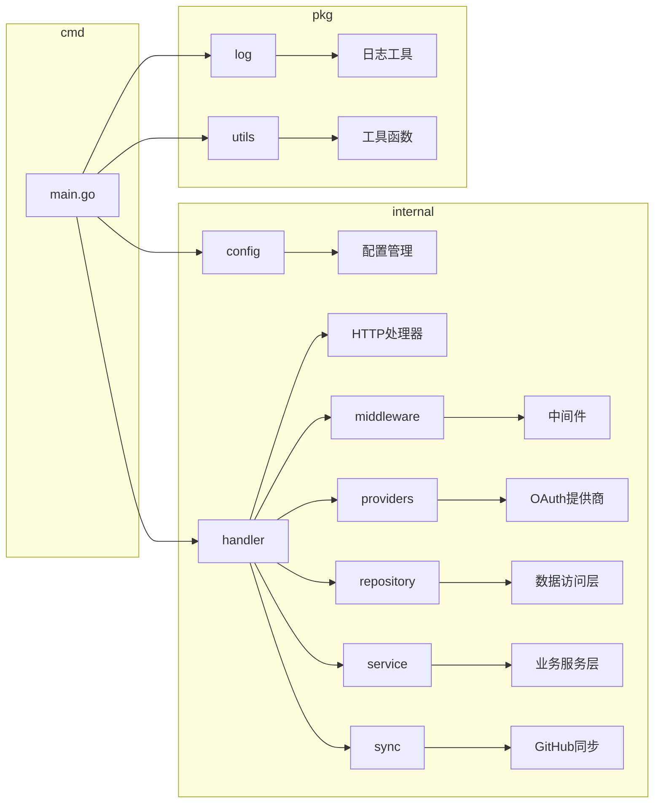
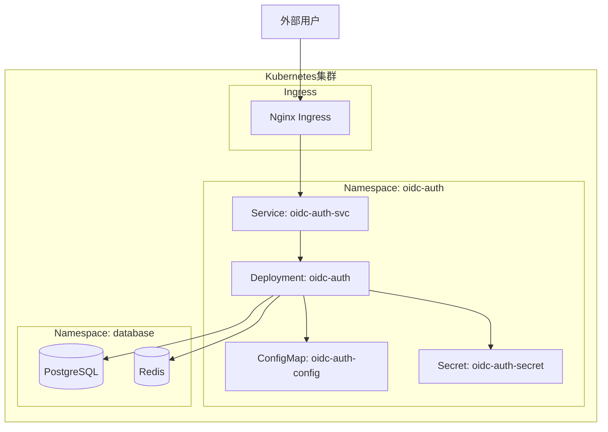

# OIDC认证服务架构文档

## 项目概述

OIDC认证服务是一个基于Go语言开发的现代化OpenID Connect认证服务器，集成Casdoor作为认证提供商，提供企业级用户认证和授权服务。

## 整体架构



## 模块架构



## 技术栈

### 核心框架
- **Gin**: HTTP Web框架，提供高性能的路由和中间件支持
- **GORM**: ORM框架，支持多种数据库
- **Viper**: 配置管理，支持多种配置源
- **Zap**: 高性能结构化日志

### 认证与安全
- **Casdoor**: OIDC认证提供商
- **JWT**: JSON Web Token令牌管理
- **AES/RSA**: 数据加密

### 数据存储
- **PostgreSQL**: 主数据库（推荐）
- **MySQL**: 备选数据库
- **Redis**: 缓存和会话存储

### 外部集成
- **GitHub API**: 用户Star状态同步
- **SMS服务**: 短信验证码发送

## 核心特性

### 1. 多平台认证支持
- VSCode插件认证
- Web应用认证
- 移动应用认证

### 2. 设备管理
- 多设备登录支持
- 设备信息记录
- Token分设备管理

### 3. GitHub集成
- 自动同步用户Star状态
- VIP等级管理
- 分布式锁防冲突

### 4. 安全特性
- 多层加密保护
- 安全头中间件
- 请求日志记录
- Token哈希存储

### 5. 高可用性
- 连接池优化
- 健康检查
- 优雅关闭
- 容器化部署

## 性能优化

### HTTP客户端优化
```yaml
# 连接池配置
maxIdleConns: 2000          # 最大空闲连接数
maxIdleConnsPerHost: 200    # 单主机最大空闲连接数
idleConnTimeout: 90s        # 空闲连接超时时间
```

### 数据库优化
```yaml
# 数据库连接池
maxIdleConns: 50    # 最大空闲连接数
maxOpenConns: 300   # 最大打开连接数
```

## 部署架构



## 监控与日志

### 日志配置
- 结构化日志输出
- 日志轮转和压缩
- 多级别日志记录
- 请求链路追踪

### 健康检查
- `/health/ready`: 就绪检查
- 数据库连接检查
- 外部服务可用性检查

## 扩展性设计

### 水平扩展
- 无状态服务设计
- 负载均衡支持
- 数据库读写分离

### 垂直扩展
- 资源配置优化
- 连接池调优
- 缓存策略优化

## 安全考虑

### 数据安全
- 敏感数据AES加密
- 密码哈希存储
- Token安全传输

### 网络安全
- HTTPS强制使用
- CORS策略配置
- 安全头设置

### 访问控制
- OAuth 2.0/OIDC标准
- 细粒度权限控制
- 会话管理