# OIDC认证流程文档

## 概述

本文档详细描述了OIDC认证服务的各种认证流程，包括插件认证、Web认证、设备管理和Token生命周期管理。

## 整体认证架构

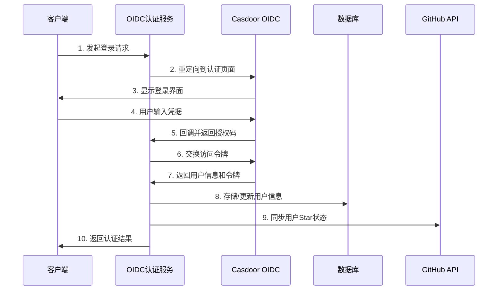
```mermaid
sequenceDiagram
    participant Client as 客户端
    participant Auth as OIDC认证服务
    participant Casdoor as Casdoor OIDC
    participant DB as 数据库
    participant GitHub as GitHub API

    Client->>Auth: 1. 发起登录请求
    Auth->>Casdoor: 2. 重定向到认证页面
    Casdoor->>Client: 3. 显示登录界面
    Client->>Casdoor: 4. 用户输入凭据
    Casdoor->>Auth: 5. 回调并返回授权码
    Auth->>Casdoor: 6. 交换访问令牌
    Casdoor->>Auth: 7. 返回用户信息和令牌
    Auth->>DB: 8. 存储/更新用户信息
    Auth->>GitHub: 9. 同步用户Star状态
    Auth->>Client: 10. 返回认证结果
```

## 插件认证流程

### VSCode插件认证

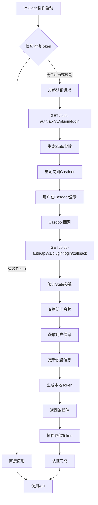
```mermaid
flowchart TD
    A[VSCode插件启动] --> B{检查本地Token}
    B -->|有效Token| C[直接使用]
    B -->|无Token或过期| D[发起认证请求]
    
    D --> E[GET /oidc-auth/api/v1/plugin/login]
    E --> F[生成State参数]
    F --> G[重定向到Casdoor]
    
    G --> H[用户在Casdoor登录]
    H --> I[Casdoor回调]
    I --> J[GET /oidc-auth/api/v1/plugin/login/callback]
    
    J --> K[验证State参数]
    K --> L[交换访问令牌]
    L --> M[获取用户信息]
    M --> N[更新设备信息]
    N --> O[生成本地Token]
    O --> P[返回给插件]
    
    P --> Q[插件存储Token]
    Q --> R[认证完成]
    
    C --> S[调用API]
    R --> S
```

### 插件认证详细步骤

1. **登录发起**
   ```http
   GET /oidc-auth/api/v1/plugin/login?state={state}&machine_code={code}&uri_scheme={scheme}&plugin_version={version}&vscode_version={version}
   ```

2. **参数说明**
   - `state`: 防CSRF攻击的随机字符串
   - `machine_code`: 设备唯一标识
   - `uri_scheme`: 回调URI方案
   - `plugin_version`: 插件版本
   - `vscode_version`: VSCode版本

3. **回调处理**
   ```http
   GET /oidc-auth/api/v1/plugin/login/callback?code={auth_code}&state={state}
   ```

## Web认证流程

### Web应用认证

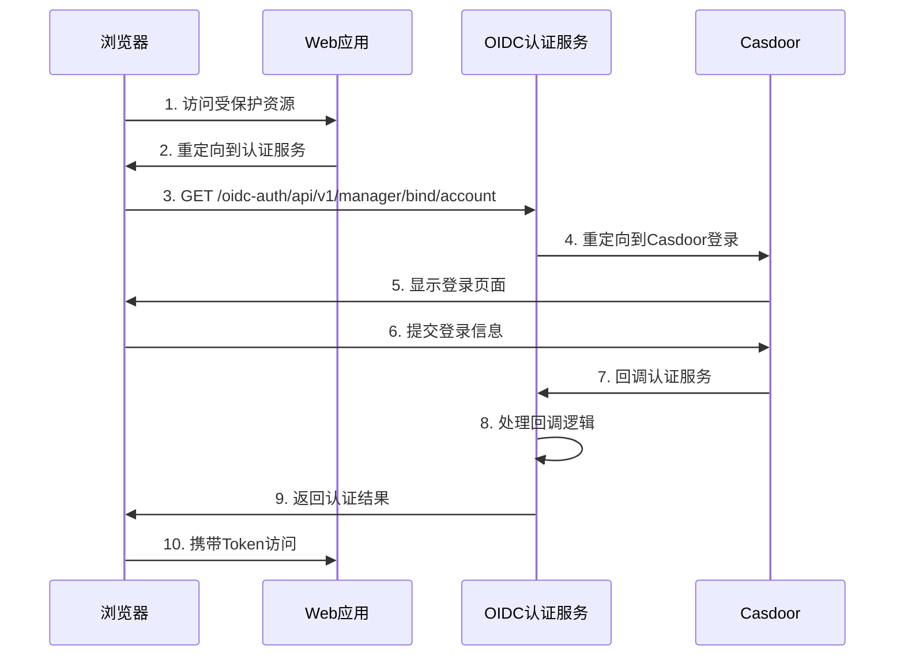
```mermaid
sequenceDiagram
    participant Browser as 浏览器
    participant WebApp as Web应用
    participant Auth as OIDC认证服务
    participant Casdoor as Casdoor

    Browser->>WebApp: 1. 访问受保护资源
    WebApp->>Browser: 2. 重定向到认证服务
    Browser->>Auth: 3. GET /oidc-auth/api/v1/manager/bind/account
    Auth->>Casdoor: 4. 重定向到Casdoor登录
    Casdoor->>Browser: 5. 显示登录页面
    Browser->>Casdoor: 6. 提交登录信息
    Casdoor->>Auth: 7. 回调认证服务
    Auth->>Auth: 8. 处理回调逻辑
    Auth->>Browser: 9. 返回认证结果
    Browser->>WebApp: 10. 携带Token访问
```

## Token管理流程

### Token生命周期

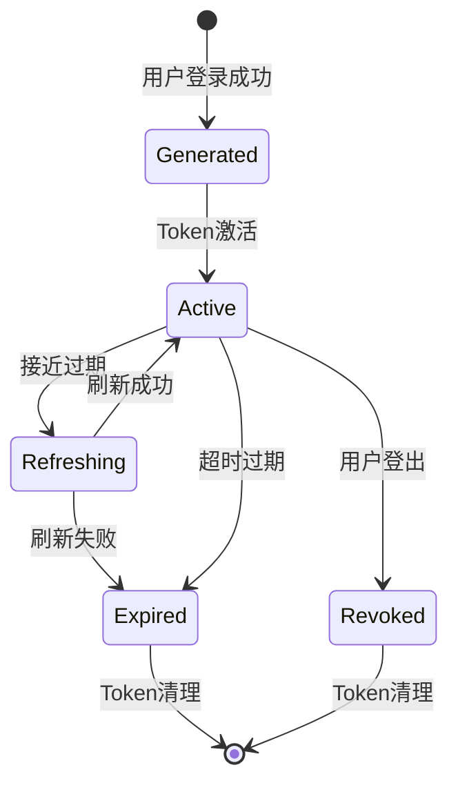
```mermaid
stateDiagram-v2
    [*] --> Generated: 用户登录成功
    Generated --> Active: Token激活
    Active --> Refreshing: 接近过期
    Refreshing --> Active: 刷新成功
    Refreshing --> Expired: 刷新失败
    Active --> Expired: 超时过期
    Expired --> [*]: Token清理
    Active --> Revoked: 用户登出
    Revoked --> [*]: Token清理
```

### Token获取和验证

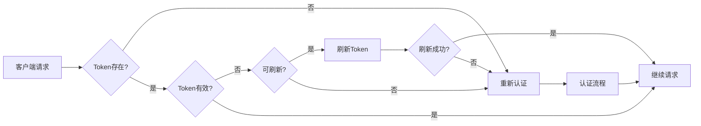
```mermaid
flowchart LR
    A[客户端请求] --> B{Token存在?}
    B -->|否| C[重新认证]
    B -->|是| D{Token有效?}
    D -->|否| E{可刷新?}
    D -->|是| F[继续请求]
    E -->|是| G[刷新Token]
    E -->|否| C
    G --> H{刷新成功?}
    H -->|是| F
    H -->|否| C
    C --> I[认证流程]
    I --> F
```

## 设备管理

### 多设备登录

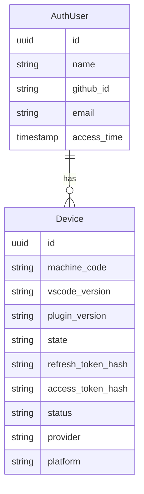
```mermaid
erDiagram
    AuthUser ||--o{ Device : has
    AuthUser {
        uuid id
        string name
        string github_id
        string email
        timestamp access_time
    }
    Device {
        uuid id
        string machine_code
        string vscode_version
        string plugin_version
        string state
        string refresh_token_hash
        string access_token_hash
        string status
        string provider
        string platform
    }
```

### 设备注册流程

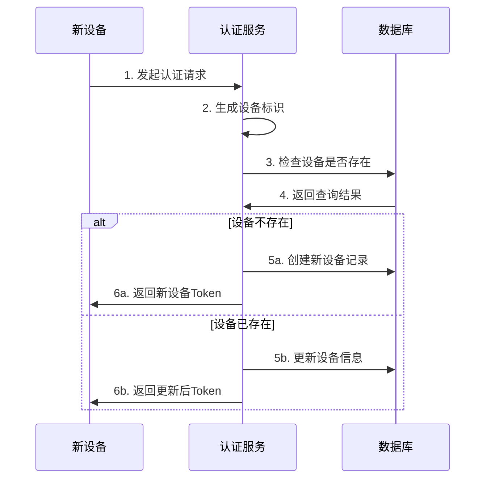
```mermaid
sequenceDiagram
    participant Device as 新设备
    participant Auth as 认证服务
    participant DB as 数据库

    Device->>Auth: 1. 发起认证请求
    Auth->>Auth: 2. 生成设备标识
    Auth->>DB: 3. 检查设备是否存在
    DB->>Auth: 4. 返回查询结果
    
    alt 设备不存在
        Auth->>DB: 5a. 创建新设备记录
        Auth->>Device: 6a. 返回新设备Token
    else 设备已存在
        Auth->>DB: 5b. 更新设备信息
        Auth->>Device: 6b. 返回更新后Token
    end
```

## SMS验证流程

### 短信验证码

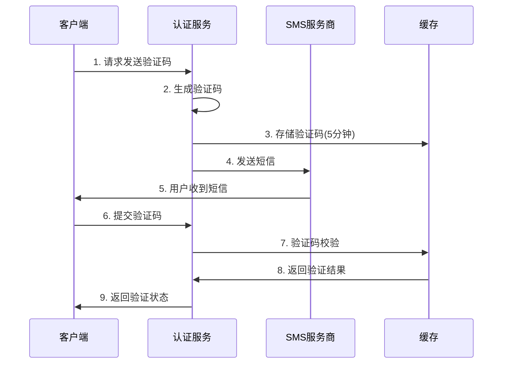
```mermaid
sequenceDiagram
    participant Client as 客户端
    participant Auth as 认证服务
    participant SMS as SMS服务商
    participant Cache as 缓存

    Client->>Auth: 1. 请求发送验证码
    Auth->>Auth: 2. 生成验证码
    Auth->>Cache: 3. 存储验证码(5分钟)
    Auth->>SMS: 4. 发送短信
    SMS->>Client: 5. 用户收到短信
    Client->>Auth: 6. 提交验证码
    Auth->>Cache: 7. 验证码校验
    Cache->>Auth: 8. 返回验证结果
    Auth->>Client: 9. 返回验证状态
```

### SMS API调用

```http
POST /oidc-auth/api/v1/send/sms
Content-Type: application/json

{
    "phone": "+86138****8888",
    "template_id": "SMS_001",
    "params": {
        "code": "123456"
    }
}
```

## GitHub Star同步

### 同步机制

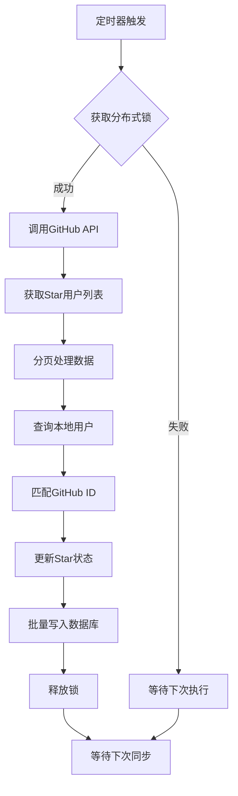
```mermaid
flowchart TD
    A[定时器触发] --> B{获取分布式锁}
    B -->|成功| C[调用GitHub API]
    B -->|失败| D[等待下次执行]
    
    C --> E[获取Star用户列表]
    E --> F[分页处理数据]
    F --> G[查询本地用户]
    G --> H[匹配GitHub ID]
    H --> I[更新Star状态]
    I --> J[批量写入数据库]
    J --> K[释放锁]
    K --> L[等待下次同步]
    
    D --> L
```

### 同步流程详解

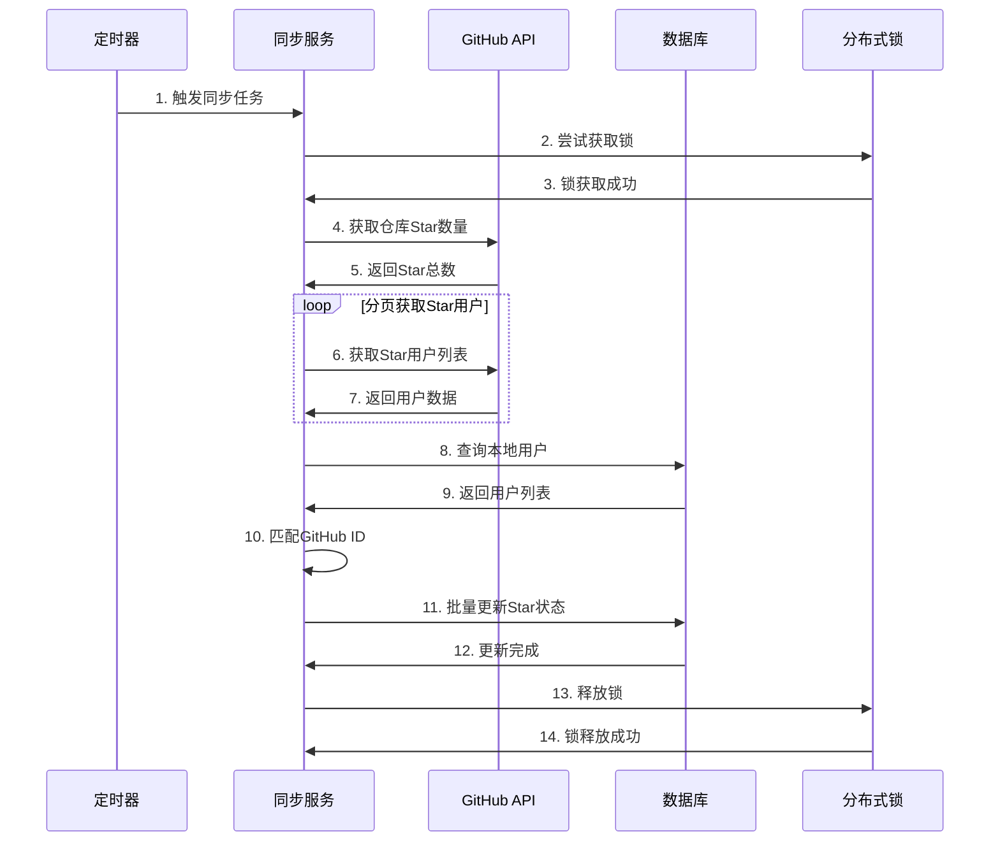
```mermaid
sequenceDiagram
    participant Timer as 定时器
    participant Sync as 同步服务
    participant GitHub as GitHub API
    participant DB as 数据库
    participant Lock as 分布式锁

    Timer->>Sync: 1. 触发同步任务
    Sync->>Lock: 2. 尝试获取锁
    Lock->>Sync: 3. 锁获取成功
    
    Sync->>GitHub: 4. 获取仓库Star数量
    GitHub->>Sync: 5. 返回Star总数
    
    loop 分页获取Star用户
        Sync->>GitHub: 6. 获取Star用户列表
        GitHub->>Sync: 7. 返回用户数据
    end
    
    Sync->>DB: 8. 查询本地用户
    DB->>Sync: 9. 返回用户列表
    
    Sync->>Sync: 10. 匹配GitHub ID
    Sync->>DB: 11. 批量更新Star状态
    DB->>Sync: 12. 更新完成
    
    Sync->>Lock: 13. 释放锁
    Lock->>Sync: 14. 锁释放成功
```

## 错误处理

### 认证错误处理

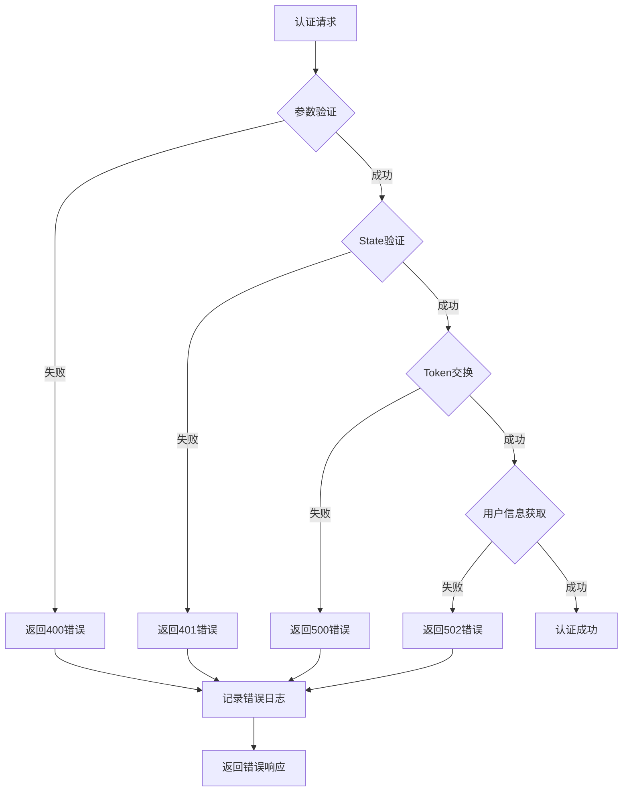
```mermaid
flowchart TD
    A[认证请求] --> B{参数验证}
    B -->|失败| C[返回400错误]
    B -->|成功| D{State验证}
    D -->|失败| E[返回401错误]
    D -->|成功| F{Token交换}
    F -->|失败| G[返回500错误]
    F -->|成功| H{用户信息获取}
    H -->|失败| I[返回502错误]
    H -->|成功| J[认证成功]
    
    C --> K[记录错误日志]
    E --> K
    G --> K
    I --> K
    K --> L[返回错误响应]
```

### 常见错误码

| 错误码 | 描述 | 处理方式 |
|--------|------|----------|
| 400 | 请求参数错误 | 检查请求参数格式 |
| 401 | 认证失败 | 重新发起认证流程 |
| 403 | 权限不足 | 检查用户权限 |
| 500 | 服务器内部错误 | 查看服务器日志 |
| 502 | 上游服务错误 | 检查Casdoor服务状态 |

## 安全考虑

### CSRF防护

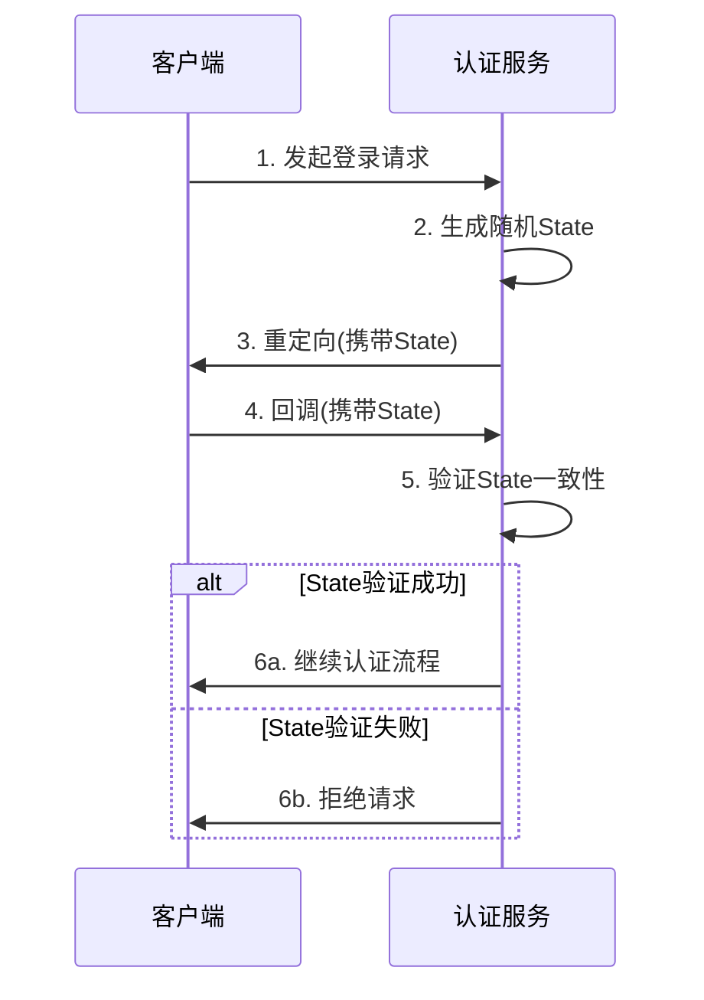
```mermaid
sequenceDiagram
    participant Client as 客户端
    participant Auth as 认证服务

    Client->>Auth: 1. 发起登录请求
    Auth->>Auth: 2. 生成随机State
    Auth->>Client: 3. 重定向(携带State)
    Client->>Auth: 4. 回调(携带State)
    Auth->>Auth: 5. 验证State一致性
    
    alt State验证成功
        Auth->>Client: 6a. 继续认证流程
    else State验证失败
        Auth->>Client: 6b. 拒绝请求
    end
```

### Token安全

- **存储安全**: Token哈希存储，原始Token不落库
- **传输安全**: HTTPS强制传输
- **生命周期**: 访问令牌短期有效，刷新令牌长期有效
- **撤销机制**: 支持主动撤销Token

## 性能优化

### 连接池优化

```yaml
# HTTP客户端配置
http:
  timeout: 60s
  maxIdleConns: 2000
  maxIdleConnsPerHost: 200
  idleConnTimeout: 90s
```

### 缓存策略

- **用户信息缓存**: 减少数据库查询
- **Token缓存**: 提高验证性能
- **配置缓存**: 减少配置文件读取

## 监控指标

### 关键指标

- 认证成功率
- 认证响应时间
- Token刷新频率
- 设备活跃度
- GitHub同步状态

### 告警规则

- 认证失败率 > 5%
- 平均响应时间 > 2s
- GitHub同步失败
- 数据库连接异常

## 邀请码功能

### 邀请码生成流程

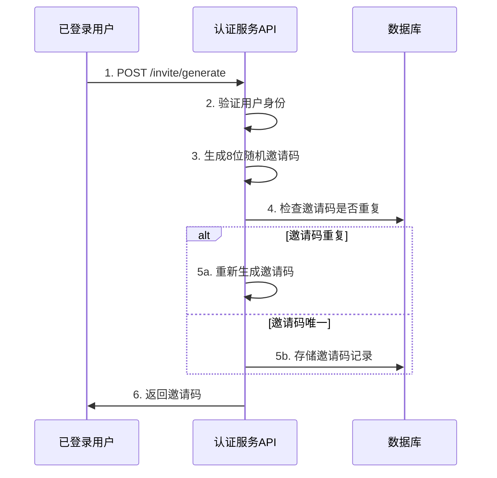
```mermaid
sequenceDiagram
    participant User as 已登录用户
    participant API as 认证服务API
    participant DB as 数据库

    User->>API: 1. POST /invite/generate
    API->>API: 2. 验证用户身份
    API->>API: 3. 生成8位随机邀请码
    API->>DB: 4. 检查邀请码是否重复
    alt 邀请码重复
        API->>API: 5a. 重新生成邀请码
    else 邀请码唯一
        API->>DB: 5b. 存储邀请码记录
    end
    API->>User: 6. 返回邀请码
```

### 邀请码使用流程

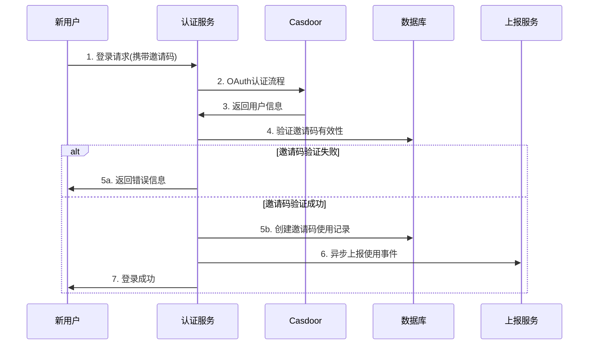
```mermaid
sequenceDiagram
    participant NewUser as 新用户
    participant Auth as 认证服务
    participant Casdoor as Casdoor
    participant DB as 数据库
    participant Report as 上报服务

    NewUser->>Auth: 1. 登录请求(携带邀请码)
    Auth->>Casdoor: 2. OAuth认证流程
    Casdoor->>Auth: 3. 返回用户信息
    Auth->>DB: 4. 验证邀请码有效性
    
    alt 邀请码验证失败
        Auth->>NewUser: 5a. 返回错误信息
    else 邀请码验证成功
        Auth->>DB: 5b. 创建邀请码使用记录
        Auth->>Report: 6. 异步上报使用事件
        Auth->>NewUser: 7. 登录成功
    end
```

### 邀请码验证规则

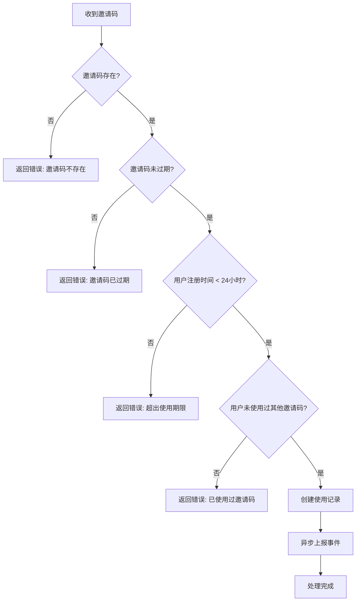
```mermaid
flowchart TD
    A[收到邀请码] --> B{邀请码存在?}
    B -->|否| C[返回错误: 邀请码不存在]
    B -->|是| D{邀请码未过期?}
    D -->|否| E[返回错误: 邀请码已过期]
    D -->|是| F{用户注册时间 < 24小时?}
    F -->|否| G[返回错误: 超出使用期限]
    F -->|是| H{用户未使用过其他邀请码?}
    H -->|否| I[返回错误: 已使用过邀请码]
    H -->|是| J[创建使用记录]
    J --> K[异步上报事件]
    K --> L[处理完成]
```

### 上报服务流程

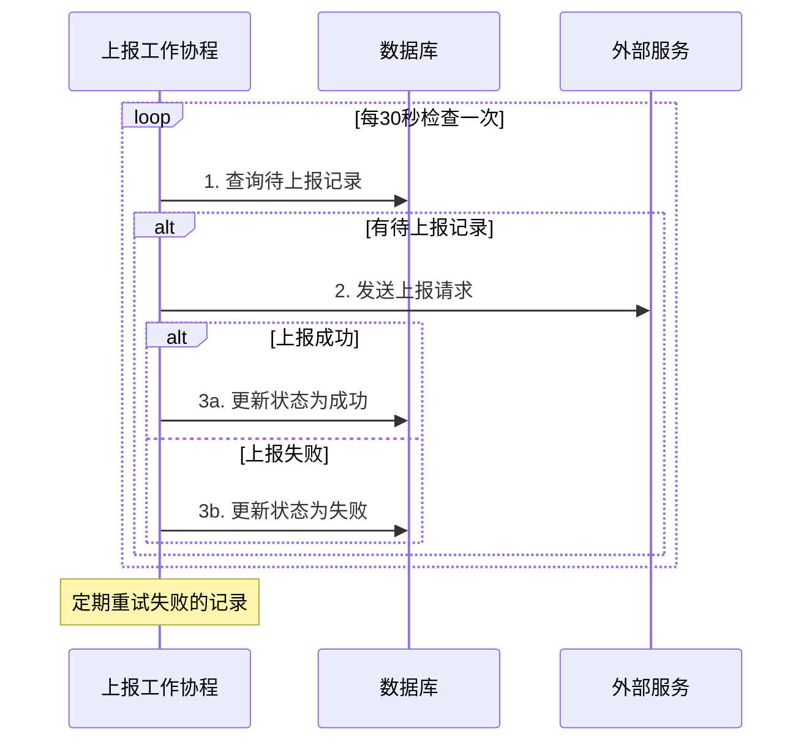
```mermaid
sequenceDiagram
    participant Worker as 上报工作协程
    participant DB as 数据库
    participant External as 外部服务

    loop 每30秒检查一次
        Worker->>DB: 1. 查询待上报记录
        alt 有待上报记录
            Worker->>External: 2. 发送上报请求
            alt 上报成功
                Worker->>DB: 3a. 更新状态为成功
            else 上报失败
                Worker->>DB: 3b. 更新状态为失败
            end
        end
    end
    
    Note over Worker: 定期重试失败的记录
```

### 邀请码数据模型

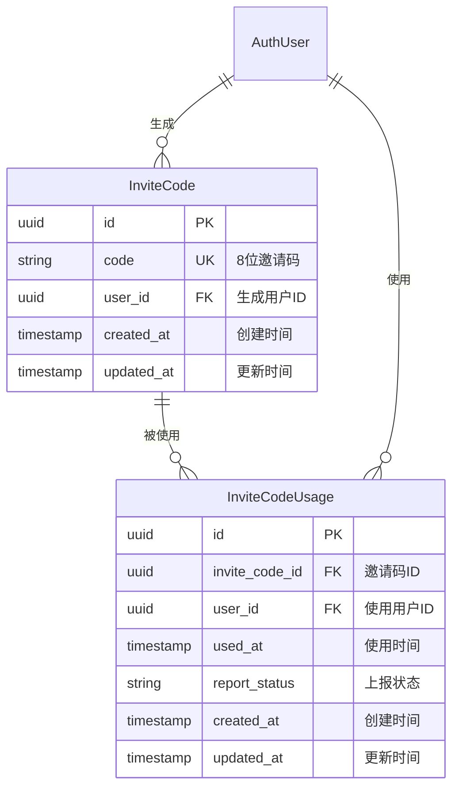
```mermaid
erDiagram
    InviteCode ||--o{ InviteCodeUsage : "被使用"
    AuthUser ||--o{ InviteCode : "生成"
    AuthUser ||--o{ InviteCodeUsage : "使用"
    
    InviteCode {
        uuid id PK
        string code UK "8位邀请码"
        uuid user_id FK "生成用户ID"
        timestamp created_at "创建时间"
        timestamp updated_at "更新时间"
    }
    
    InviteCodeUsage {
        uuid id PK
        uuid invite_code_id FK "邀请码ID"
        uuid user_id FK "使用用户ID"
        timestamp used_at "使用时间"
        string report_status "上报状态"
        timestamp created_at "创建时间"
        timestamp updated_at "更新时间"
    }
```

### 配置说明

```yaml
# 邀请码上报服务配置
report:
  # 启用邀请码使用上报
  enabled: true
  
  # 外部服务上报URL
  reportURL: "https://your-service.com/api/invite-code-usage"
  
  # 请求超时时间(秒)
  timeout: 30
  
  # 最大重试次数
  maxRetries: 3
```

### 邀请码API使用示例

#### 生成邀请码

```bash
curl -X POST "https://auth.yourdomain.com/oidc-auth/api/v1/invite/generate" \
  -H "Content-Type: application/json" \
  -d '{
    "user_id": "123e4567-e89b-12d3-a456-426614174000"
  }'
```

#### 使用邀请码登录

```bash
curl -X GET "https://auth.yourdomain.com/oidc-auth/api/v1/plugin/login?state=abc123&machine_code=device001&invite_code=ABC12345"
```

### 邀请码业务规则

1. **生成规则**
   - 邀请码长度为8位
   - 使用大写字母和数字组合
   - 确保全局唯一性

2. **使用规则**
   - 邀请码有效期为30天
   - 用户注册后24小时内可使用邀请码
   - 每个用户只能使用一次邀请码
   - 邀请码可被多个用户使用

3. **上报规则**
   - 邀请码使用成功后异步上报
   - 上报失败会定期重试
   - 最多重试3次
   - 支持批量上报优化