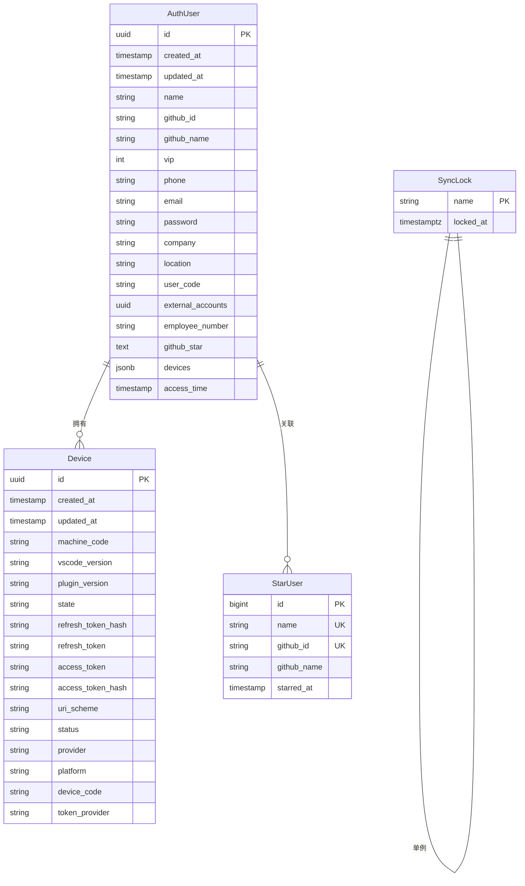
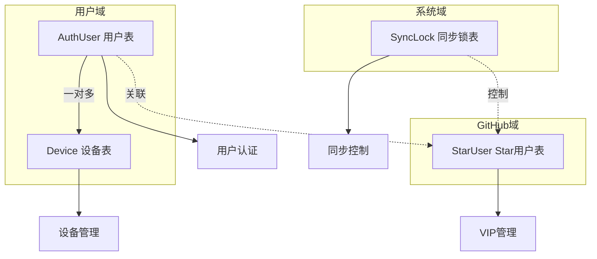
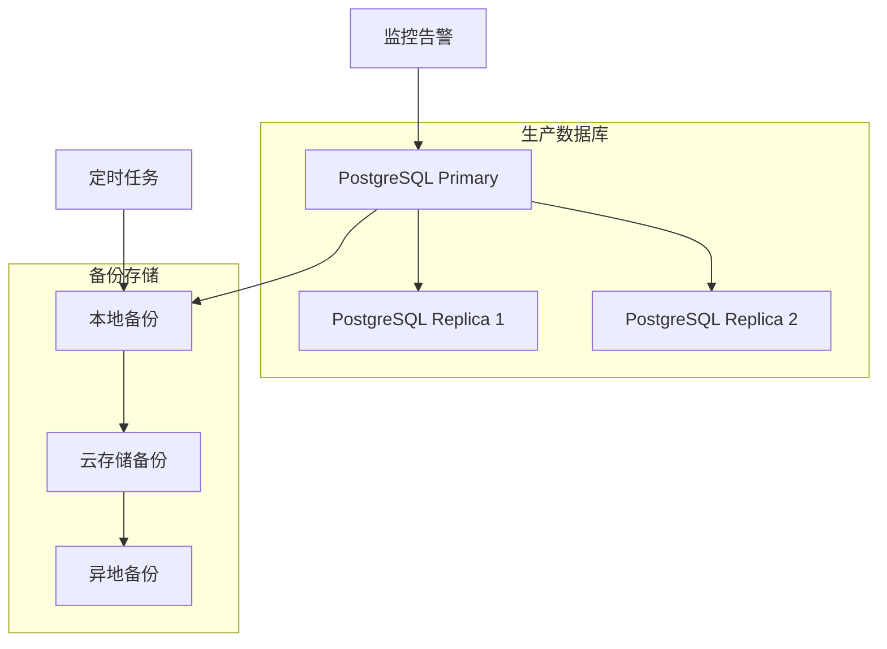

# OIDC认证服务数据库设计文档

## 概述

本文档详细描述了OIDC认证服务的数据库设计，包括表结构、关系模型、索引策略和数据迁移方案。

## 数据库架构图



## 表结构详细设计

### 1. 用户表 (auth_users)

用户表是核心表，存储所有认证用户的基本信息。

```sql
CREATE TABLE auth_users (
    id UUID PRIMARY KEY DEFAULT gen_random_uuid(),
    created_at TIMESTAMPTZ NOT NULL DEFAULT NOW(),
    updated_at TIMESTAMPTZ NOT NULL DEFAULT NOW(),
    name VARCHAR(100),
    github_id VARCHAR(100),
    github_name VARCHAR(100),
    vip INTEGER DEFAULT 0,
    phone VARCHAR(20),
    email VARCHAR(100),
    password VARCHAR(100),
    company VARCHAR(100),
    location VARCHAR(100),
    user_code VARCHAR(100),
    external_accounts UUID,
    employee_number VARCHAR(100),
    github_star TEXT,
    devices JSONB,
    access_time TIMESTAMPTZ
);

-- 索引
CREATE INDEX idx_auth_users_email ON auth_users(email);
CREATE INDEX idx_auth_users_github_id ON auth_users(github_id);
CREATE INDEX idx_auth_users_name ON auth_users(name);
CREATE INDEX idx_auth_users_access_time ON auth_users(access_time);
```

#### 字段说明

| 字段名 | 类型 | 约束 | 描述 |
|--------|------|------|------|
| id | UUID | PK | 用户唯一标识 |
| created_at | TIMESTAMPTZ | NOT NULL | 创建时间 |
| updated_at | TIMESTAMPTZ | NOT NULL | 更新时间 |
| name | VARCHAR(100) | - | 用户姓名 |
| github_id | VARCHAR(100) | - | GitHub用户ID |
| github_name | VARCHAR(100) | - | GitHub用户名 |
| vip | INTEGER | DEFAULT 0 | VIP等级 (0=普通用户, 1=VIP) |
| phone | VARCHAR(20) | - | 手机号码 |
| email | VARCHAR(100) | - | 邮箱地址 |
| password | VARCHAR(100) | - | 密码哈希 |
| company | VARCHAR(100) | - | 公司名称 |
| location | VARCHAR(100) | - | 地理位置 |
| user_code | VARCHAR(100) | - | 用户代码 |
| external_accounts | UUID | - | 外部账户关联 |
| employee_number | VARCHAR(100) | - | 员工编号 |
| github_star | TEXT | - | GitHub Star状态 |
| devices | JSONB | - | 设备信息JSON |
| access_time | TIMESTAMPTZ | - | 最后访问时间 |

### 2. 设备表 (devices)

设备表存储用户的设备信息，支持多设备登录。

```sql
CREATE TABLE devices (
    id UUID PRIMARY KEY DEFAULT gen_random_uuid(),
    created_at TIMESTAMPTZ NOT NULL DEFAULT NOW(),
    updated_at TIMESTAMPTZ NOT NULL DEFAULT NOW(),
    machine_code VARCHAR(255) NOT NULL,
    vscode_version VARCHAR(50),
    plugin_version VARCHAR(50),
    state VARCHAR(255),
    refresh_token_hash VARCHAR(255),
    refresh_token TEXT,
    access_token TEXT,
    access_token_hash VARCHAR(255),
    uri_scheme VARCHAR(100),
    status VARCHAR(20) DEFAULT 'active',
    provider VARCHAR(50),
    platform VARCHAR(50),
    device_code VARCHAR(255),
    token_provider VARCHAR(20),
    user_id UUID REFERENCES auth_users(id) ON DELETE CASCADE
);

-- 索引
CREATE UNIQUE INDEX idx_devices_machine_code ON devices(machine_code);
CREATE INDEX idx_devices_user_id ON devices(user_id);
CREATE INDEX idx_devices_status ON devices(status);
CREATE INDEX idx_devices_access_token_hash ON devices(access_token_hash);
```

#### 设备状态枚举

```sql
CREATE TYPE device_status AS ENUM ('active', 'inactive', 'revoked', 'expired');
ALTER TABLE devices ALTER COLUMN status TYPE device_status USING status::device_status;
```

### 3. GitHub Star用户表 (star_users)

存储GitHub仓库的Star用户信息，用于同步和VIP管理。

```sql
CREATE TABLE star_users (
    id BIGSERIAL PRIMARY KEY,
    name VARCHAR(100) NOT NULL UNIQUE,
    github_id VARCHAR(50) NOT NULL UNIQUE,
    github_name VARCHAR(100) NOT NULL,
    starred_at TIMESTAMP
);

-- 索引
CREATE UNIQUE INDEX idx_star_users_name ON star_users(name);
CREATE UNIQUE INDEX idx_star_users_github_id ON star_users(github_id);
CREATE INDEX idx_star_users_starred_at ON star_users(starred_at);
```

### 4. 同步锁表 (sync_locks)

分布式锁表，防止多实例同时执行GitHub同步任务。

```sql
CREATE TABLE sync_locks (
    name VARCHAR(100) PRIMARY KEY,
    locked_at TIMESTAMPTZ NOT NULL DEFAULT NOW()
);

-- 自动清理过期锁的函数
CREATE OR REPLACE FUNCTION cleanup_expired_locks()
RETURNS void AS $$
BEGIN
    DELETE FROM sync_locks 
    WHERE locked_at < NOW() - INTERVAL '10 minutes';
END;
$$ LANGUAGE plpgsql;

-- 定时任务清理过期锁
SELECT cron.schedule('cleanup-locks', '*/5 * * * *', 'SELECT cleanup_expired_locks();');
```

## 数据关系图



## 索引策略

### 1. 主键索引

所有表都有主键索引，使用UUID或自增ID。

### 2. 唯一索引

```sql
-- 用户表
CREATE UNIQUE INDEX idx_auth_users_email_unique ON auth_users(email) WHERE email IS NOT NULL;
CREATE UNIQUE INDEX idx_auth_users_github_id_unique ON auth_users(github_id) WHERE github_id IS NOT NULL;

-- 设备表
CREATE UNIQUE INDEX idx_devices_machine_code_unique ON devices(machine_code);

-- Star用户表
CREATE UNIQUE INDEX idx_star_users_github_id_unique ON star_users(github_id);
```

### 3. 复合索引

```sql
-- 用户设备查询优化
CREATE INDEX idx_auth_users_github_vip ON auth_users(github_id, vip);

-- 设备状态查询优化
CREATE INDEX idx_devices_user_status ON devices(user_id, status);

-- 时间范围查询优化
CREATE INDEX idx_auth_users_created_updated ON auth_users(created_at, updated_at);
```

### 4. 部分索引

```sql
-- 只为活跃设备创建索引
CREATE INDEX idx_devices_active ON devices(user_id) WHERE status = 'active';

-- 只为有GitHub ID的用户创建索引
CREATE INDEX idx_auth_users_github_active ON auth_users(github_id) WHERE github_id IS NOT NULL;
```

## 查询优化

### 1. 常用查询模式

```sql
-- 根据GitHub ID查找用户
EXPLAIN ANALYZE
SELECT * FROM auth_users WHERE github_id = '12345';

-- 查找用户的所有活跃设备
EXPLAIN ANALYZE
SELECT d.* FROM devices d
JOIN auth_users u ON d.user_id = u.id
WHERE u.github_id = '12345' AND d.status = 'active';

-- 查找VIP用户
EXPLAIN ANALYZE
SELECT * FROM auth_users WHERE vip > 0 AND github_star IS NOT NULL;
```

### 2. 查询性能监控

```sql
-- 创建查询性能监控视图
CREATE VIEW slow_queries AS
SELECT 
    query,
    calls,
    total_time,
    mean_time,
    rows
FROM pg_stat_statements
WHERE mean_time > 100  -- 超过100ms的查询
ORDER BY mean_time DESC;
```

## 数据迁移

### 1. 版本控制

```sql
-- 创建迁移版本表
CREATE TABLE schema_migrations (
    version VARCHAR(20) PRIMARY KEY,
    applied_at TIMESTAMPTZ DEFAULT NOW()
);
```

### 2. 迁移脚本示例

#### V1.0.0 - 初始化表结构

```sql
-- migrations/V1.0.0__initial_schema.sql
BEGIN;

-- 创建用户表
CREATE TABLE auth_users (
    id UUID PRIMARY KEY DEFAULT gen_random_uuid(),
    created_at TIMESTAMPTZ NOT NULL DEFAULT NOW(),
    updated_at TIMESTAMPTZ NOT NULL DEFAULT NOW(),
    name VARCHAR(100),
    email VARCHAR(100)
);

-- 插入迁移记录
INSERT INTO schema_migrations (version) VALUES ('1.0.0');

COMMIT;
```

#### V1.1.0 - 添加GitHub集成

```sql
-- migrations/V1.1.0__add_github_integration.sql
BEGIN;

-- 添加GitHub相关字段
ALTER TABLE auth_users 
ADD COLUMN github_id VARCHAR(100),
ADD COLUMN github_name VARCHAR(100),
ADD COLUMN github_star TEXT;

-- 创建索引
CREATE INDEX idx_auth_users_github_id ON auth_users(github_id);

-- 创建Star用户表
CREATE TABLE star_users (
    id BIGSERIAL PRIMARY KEY,
    name VARCHAR(100) NOT NULL UNIQUE,
    github_id VARCHAR(50) NOT NULL UNIQUE,
    github_name VARCHAR(100) NOT NULL,
    starred_at TIMESTAMP
);

-- 插入迁移记录
INSERT INTO schema_migrations (version) VALUES ('1.1.0');

COMMIT;
```

### 3. 回滚脚本

```sql
-- rollbacks/V1.1.0__rollback_github_integration.sql
BEGIN;

-- 删除Star用户表
DROP TABLE IF EXISTS star_users;

-- 删除GitHub相关字段
ALTER TABLE auth_users 
DROP COLUMN IF EXISTS github_id,
DROP COLUMN IF EXISTS github_name,
DROP COLUMN IF EXISTS github_star;

-- 删除迁移记录
DELETE FROM schema_migrations WHERE version = '1.1.0';

COMMIT;
```

## 数据备份策略

### 1. 备份架构



### 2. 备份脚本

```bash
#!/bin/bash
# backup.sh

DB_NAME="auth"
DB_USER="postgres"
BACKUP_DIR="/backup"
DATE=$(date +%Y%m%d_%H%M%S)

# 全量备份
pg_dump -U $DB_USER -h localhost $DB_NAME > $BACKUP_DIR/full_backup_$DATE.sql

# 压缩备份
gzip $BACKUP_DIR/full_backup_$DATE.sql

# 增量备份 (WAL归档)
pg_basebackup -U $DB_USER -h localhost -D $BACKUP_DIR/incremental_$DATE -Ft -z -P

# 清理7天前的备份
find $BACKUP_DIR -name "*.sql.gz" -mtime +7 -delete
find $BACKUP_DIR -name "incremental_*" -mtime +7 -exec rm -rf {} \;

# 上传到云存储
aws s3 sync $BACKUP_DIR s3://your-backup-bucket/database/
```

### 3. 恢复流程

```bash
#!/bin/bash
# restore.sh

BACKUP_FILE=$1
DB_NAME="auth"
DB_USER="postgres"

if [ -z "$BACKUP_FILE" ]; then
    echo "Usage: $0 <backup_file>"
    exit 1
fi

# 停止应用服务
kubectl scale deployment oidc-auth --replicas=0 -n oidc-auth

# 创建新数据库
createdb -U $DB_USER ${DB_NAME}_restore

# 恢复数据
gunzip -c $BACKUP_FILE | psql -U $DB_USER ${DB_NAME}_restore

# 验证数据完整性
psql -U $DB_USER ${DB_NAME}_restore -c "SELECT COUNT(*) FROM auth_users;"

# 切换数据库
psql -U $DB_USER -c "ALTER DATABASE $DB_NAME RENAME TO ${DB_NAME}_old;"
psql -U $DB_USER -c "ALTER DATABASE ${DB_NAME}_restore RENAME TO $DB_NAME;"

# 重启应用服务
kubectl scale deployment oidc-auth --replicas=3 -n oidc-auth
```

## 性能监控

### 1. 关键指标

```sql
-- 数据库连接数
SELECT count(*) as active_connections 
FROM pg_stat_activity 
WHERE state = 'active';

-- 表大小统计
SELECT 
    schemaname,
    tablename,
    pg_size_pretty(pg_total_relation_size(schemaname||'.'||tablename)) as size
FROM pg_tables 
WHERE schemaname = 'public'
ORDER BY pg_total_relation_size(schemaname||'.'||tablename) DESC;

-- 索引使用情况
SELECT 
    schemaname,
    tablename,
    indexname,
    idx_scan,
    idx_tup_read,
    idx_tup_fetch
FROM pg_stat_user_indexes
ORDER BY idx_scan DESC;
```

### 2. 慢查询监控

```sql
-- 启用慢查询日志
ALTER SYSTEM SET log_min_duration_statement = 1000; -- 1秒
SELECT pg_reload_conf();

-- 查看慢查询统计
SELECT 
    query,
    calls,
    total_time,
    mean_time,
    stddev_time,
    rows
FROM pg_stat_statements
WHERE mean_time > 1000  -- 超过1秒的查询
ORDER BY mean_time DESC
LIMIT 10;
```

## 数据安全

### 1. 敏感数据加密

```sql
-- 创建加密函数
CREATE OR REPLACE FUNCTION encrypt_sensitive_data(data TEXT)
RETURNS TEXT AS $$
BEGIN
    RETURN pgp_sym_encrypt(data, current_setting('app.encryption_key'));
END;
$$ LANGUAGE plpgsql;

-- 创建解密函数
CREATE OR REPLACE FUNCTION decrypt_sensitive_data(encrypted_data TEXT)
RETURNS TEXT AS $$
BEGIN
    RETURN pgp_sym_decrypt(encrypted_data, current_setting('app.encryption_key'));
END;
$$ LANGUAGE plpgsql;
```

### 2. 行级安全策略

```sql
-- 启用行级安全
ALTER TABLE auth_users ENABLE ROW LEVEL SECURITY;

-- 创建策略：用户只能访问自己的数据
CREATE POLICY user_isolation_policy ON auth_users
    FOR ALL TO app_user
    USING (id = current_setting('app.current_user_id')::UUID);
```

### 3. 审计日志

```sql
-- 创建审计日志表
CREATE TABLE audit_logs (
    id BIGSERIAL PRIMARY KEY,
    table_name VARCHAR(50) NOT NULL,
    operation VARCHAR(10) NOT NULL,
    old_values JSONB,
    new_values JSONB,
    user_id UUID,
    timestamp TIMESTAMPTZ DEFAULT NOW()
);

-- 创建审计触发器函数
CREATE OR REPLACE FUNCTION audit_trigger_function()
RETURNS TRIGGER AS $$
BEGIN
    IF TG_OP = 'DELETE' THEN
        INSERT INTO audit_logs (table_name, operation, old_values, user_id)
        VALUES (TG_TABLE_NAME, TG_OP, row_to_json(OLD), OLD.id);
        RETURN OLD;
    ELSIF TG_OP = 'UPDATE' THEN
        INSERT INTO audit_logs (table_name, operation, old_values, new_values, user_id)
        VALUES (TG_TABLE_NAME, TG_OP, row_to_json(OLD), row_to_json(NEW), NEW.id);
        RETURN NEW;
    ELSIF TG_OP = 'INSERT' THEN
        INSERT INTO audit_logs (table_name, operation, new_values, user_id)
        VALUES (TG_TABLE_NAME, TG_OP, row_to_json(NEW), NEW.id);
        RETURN NEW;
    END IF;
    RETURN NULL;
END;
$$ LANGUAGE plpgsql;

-- 为用户表添加审计触发器
CREATE TRIGGER auth_users_audit_trigger
    AFTER INSERT OR UPDATE OR DELETE ON auth_users
    FOR EACH ROW EXECUTE FUNCTION audit_trigger_function();
```

## 容量规划

### 1. 存储估算

| 表名 | 预估记录数 | 单条记录大小 | 总存储空间 | 索引空间 |
|------|------------|--------------|------------|----------|
| auth_users | 100万 | 1KB | 1GB | 500MB |
| devices | 300万 | 500B | 1.5GB | 800MB |
| star_users | 10万 | 200B | 20MB | 10MB |
| audit_logs | 1000万 | 2KB | 20GB | 5GB |

### 2. 性能基准

```sql
-- 用户查询性能测试
EXPLAIN (ANALYZE, BUFFERS) 
SELECT * FROM auth_users WHERE github_id = '12345';

-- 设备查询性能测试
EXPLAIN (ANALYZE, BUFFERS)
SELECT d.* FROM devices d
JOIN auth_users u ON d.user_id = u.id
WHERE u.email = 'user@example.com' AND d.status = 'active';

-- 批量更新性能测试
EXPLAIN (ANALYZE, BUFFERS)
UPDATE auth_users SET github_star = 'zgsm-ai.oidc-auth'
WHERE github_id IN (SELECT github_id FROM star_users);
```

### 5. 邀请码表 (invite_codes)

存储用户生成的邀请码信息。

```sql
CREATE TABLE invite_codes (
    id UUID PRIMARY KEY DEFAULT gen_random_uuid(),
    code VARCHAR(32) NOT NULL UNIQUE,
    user_id UUID NOT NULL,
    created_at TIMESTAMPTZ NOT NULL DEFAULT NOW(),
    updated_at TIMESTAMPTZ NOT NULL DEFAULT NOW(),
    FOREIGN KEY (user_id) REFERENCES auth_users(id) ON DELETE CASCADE
);

-- 索引
CREATE UNIQUE INDEX idx_invite_codes_code ON invite_codes(code);
CREATE INDEX idx_invite_codes_user_id ON invite_codes(user_id);
CREATE INDEX idx_invite_codes_created_at ON invite_codes(created_at);
```

### 6. 邀请码使用记录表 (invite_code_usages)

存储邀请码的使用记录和上报状态。

```sql
CREATE TABLE invite_code_usages (
    id UUID PRIMARY KEY DEFAULT gen_random_uuid(),
    invite_code_id UUID NOT NULL,
    user_id UUID NOT NULL,
    used_at TIMESTAMPTZ NOT NULL DEFAULT NOW(),
    report_status VARCHAR(20) DEFAULT 'pending',
    created_at TIMESTAMPTZ NOT NULL DEFAULT NOW(),
    updated_at TIMESTAMPTZ NOT NULL DEFAULT NOW(),
    FOREIGN KEY (invite_code_id) REFERENCES invite_codes(id) ON DELETE CASCADE,
    FOREIGN KEY (user_id) REFERENCES auth_users(id) ON DELETE CASCADE
);

-- 索引
CREATE INDEX idx_invite_code_usages_invite_code_id ON invite_code_usages(invite_code_id);
CREATE INDEX idx_invite_code_usages_user_id ON invite_code_usages(user_id);
CREATE INDEX idx_invite_code_usages_report_status ON invite_code_usages(report_status);
CREATE INDEX idx_invite_code_usages_used_at ON invite_code_usages(used_at);

-- 确保每个用户只能使用一次邀请码
CREATE UNIQUE INDEX idx_invite_code_usages_user_unique ON invite_code_usages(user_id);
```

## 邀请码功能迁移

### V1.4.0 - 添加邀请码功能

```sql
-- migrations/V1.4.0__add_invite_code_tables.sql
BEGIN;

-- 创建邀请码表
CREATE TABLE invite_codes (
    id UUID PRIMARY KEY DEFAULT gen_random_uuid(),
    code VARCHAR(32) NOT NULL UNIQUE,
    user_id UUID NOT NULL,
    created_at TIMESTAMPTZ NOT NULL DEFAULT NOW(),
    updated_at TIMESTAMPTZ NOT NULL DEFAULT NOW(),
    FOREIGN KEY (user_id) REFERENCES auth_users(id) ON DELETE CASCADE
);

-- 创建邀请码使用记录表
CREATE TABLE invite_code_usages (
    id UUID PRIMARY KEY DEFAULT gen_random_uuid(),
    invite_code_id UUID NOT NULL,
    user_id UUID NOT NULL,
    used_at TIMESTAMPTZ NOT NULL DEFAULT NOW(),
    report_status VARCHAR(20) DEFAULT 'pending',
    created_at TIMESTAMPTZ NOT NULL DEFAULT NOW(),
    updated_at TIMESTAMPTZ NOT NULL DEFAULT NOW(),
    FOREIGN KEY (invite_code_id) REFERENCES invite_codes(id) ON DELETE CASCADE,
    FOREIGN KEY (user_id) REFERENCES auth_users(id) ON DELETE CASCADE
);

-- 创建索引
CREATE UNIQUE INDEX idx_invite_codes_code ON invite_codes(code);
CREATE INDEX idx_invite_codes_user_id ON invite_codes(user_id);
CREATE INDEX idx_invite_codes_created_at ON invite_codes(created_at);

CREATE INDEX idx_invite_code_usages_invite_code_id ON invite_code_usages(invite_code_id);
CREATE INDEX idx_invite_code_usages_user_id ON invite_code_usages(user_id);
CREATE INDEX idx_invite_code_usages_report_status ON invite_code_usages(report_status);
CREATE INDEX idx_invite_code_usages_used_at ON invite_code_usages(used_at);
CREATE UNIQUE INDEX idx_invite_code_usages_user_unique ON invite_code_usages(user_id);

-- 插入迁移记录
INSERT INTO schema_migrations (version) VALUES ('1.4.0');

COMMIT;
```

## 更新后的容量规划

### 存储估算（包含邀请码表）

| 表名 | 预估记录数 | 单条记录大小 | 总存储空间 | 索引空间 |
|------|------------|--------------|------------|----------|
| auth_users | 100万 | 1KB | 1GB | 500MB |
| devices | 300万 | 500B | 1.5GB | 800MB |
| star_users | 10万 | 200B | 20MB | 10MB |
| invite_codes | 50万 | 150B | 75MB | 50MB |
| invite_code_usages | 20万 | 200B | 40MB | 30MB |
| audit_logs | 1000万 | 2KB | 20GB | 5GB |

这个数据库设计文档提供了完整的表结构、索引策略、查询优化、备份恢复和安全策略，包括新增的邀请码功能，为OIDC认证服务提供了坚实的数据基础。