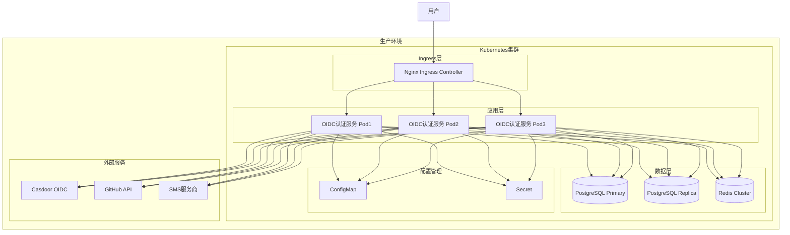
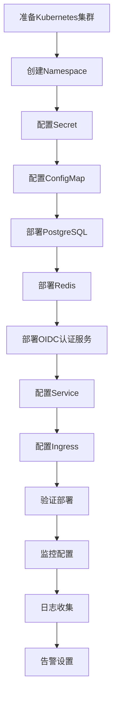
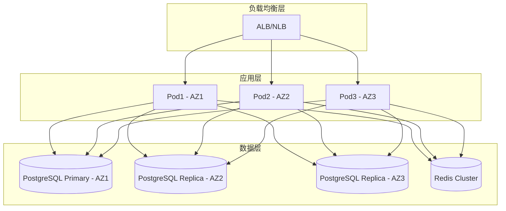
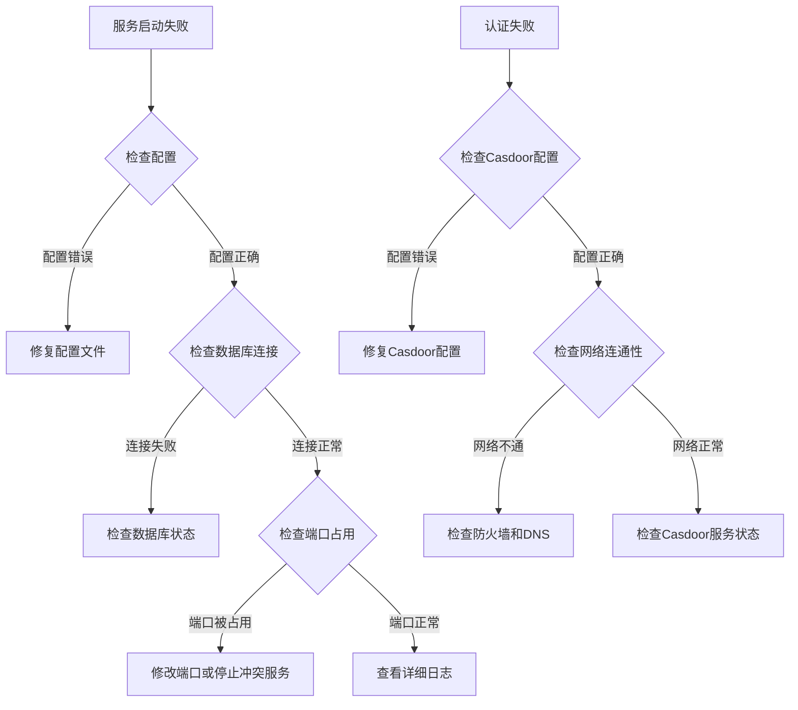

# OIDC认证服务部署指南

## 概述

本文档提供了OIDC认证服务的完整部署指南，包括本地开发、Docker部署和Kubernetes生产环境部署。

## 部署架构图



## 环境要求

### 基础要求
- **Go**: 1.23.0+
- **数据库**: PostgreSQL 13+ 或 MySQL 8.0+
- **缓存**: Redis 6.0+ (可选)
- **容器**: Docker 20.10+ (容器化部署)
- **编排**: Kubernetes 1.20+ (生产环境)

### 硬件要求

| 环境 | CPU | 内存 | 存储 | 网络 |
|------|-----|------|------|------|
| 开发环境 | 2核 | 4GB | 20GB | 100Mbps |
| 测试环境 | 4核 | 8GB | 50GB | 1Gbps |
| 生产环境 | 8核+ | 16GB+ | 100GB+ | 10Gbps |

## 本地开发部署

### 1. 环境准备

```bash
# 克隆项目
git clone https://github.com/zgsm-ai/oidc-auth.git
cd oidc-auth

# 安装Go依赖
go mod tidy

# 准备配置文件
cp config/config.yaml config/config.local.yaml
```

### 2. 数据库准备

#### PostgreSQL安装
```bash
# macOS
brew install postgresql
brew services start postgresql

# Ubuntu
sudo apt update
sudo apt install postgresql postgresql-contrib
sudo systemctl start postgresql
sudo systemctl enable postgresql

# 创建数据库
sudo -u postgres createdb auth
```

#### MySQL安装
```bash
# macOS
brew install mysql
brew services start mysql

# Ubuntu
sudo apt update
sudo apt install mysql-server
sudo systemctl start mysql
sudo systemctl enable mysql

# 创建数据库
mysql -u root -p
CREATE DATABASE auth CHARACTER SET utf8mb4 COLLATE utf8mb4_unicode_ci;
```

### 3. 配置文件设置

```yaml
# config/config.local.yaml
server:
  serverPort: "8080"
  baseURL: "http://localhost:8080"
  isPrivate: false

database:
  type: "postgres"  # 或 "mysql"
  host: "localhost"
  port: 5432        # PostgreSQL: 5432, MySQL: 3306
  username: "postgres"
  password: "your_password"
  dbname: "auth"

providers:
  casdoor:
    clientID: "your_casdoor_client_id"
    clientSecret: "your_casdoor_client_secret"
    baseURL: "https://your-casdoor-domain.com"
    internalURL: "https://your-casdoor-domain.com"

encrypt:
  aesKey: "your_32_character_aes_key_here!!"
```

### 4. 启动服务

```bash
# 直接运行
go run cmd/main.go serve --config config/config.local.yaml

# 或者构建后运行
go build -o oidc-auth cmd/main.go
./oidc-auth serve --config config/config.local.yaml
```

### 5. 验证部署

```bash
# 健康检查
curl http://localhost:8080/health/ready

# 预期响应
{
  "status": "ready",
  "timestamp": "2024-01-01T00:00:00Z"
}
```

## Docker部署

### 1. 构建镜像

```dockerfile
# Dockerfile已存在，直接构建
docker build -t oidc-auth:latest .
```

### 2. Docker Compose部署

```yaml
# docker-compose.yml
version: '3.8'

services:
  oidc-auth:
    image: oidc-auth:latest
    ports:
      - "8080:8080"
    environment:
      - SERVER_BASEURL=http://localhost:8080
      - DATABASE_HOST=postgres
      - DATABASE_PASSWORD=your_password
      - PROVIDERS_CASDOOR_CLIENTID=your_client_id
      - PROVIDERS_CASDOOR_CLIENTSECRET=your_client_secret
      - PROVIDERS_CASDOOR_BASEURL=https://your-casdoor.com
      - ENCRYPT_AESKEY=your_32_character_aes_key_here!!
    depends_on:
      - postgres
      - redis
    networks:
      - oidc-network

  postgres:
    image: postgres:15
    environment:
      - POSTGRES_DB=auth
      - POSTGRES_USER=postgres
      - POSTGRES_PASSWORD=your_password
    volumes:
      - postgres_data:/var/lib/postgresql/data
    networks:
      - oidc-network

  redis:
    image: redis:7-alpine
    networks:
      - oidc-network

volumes:
  postgres_data:

networks:
  oidc-network:
    driver: bridge
```

### 3. 启动服务

```bash
# 启动所有服务
docker-compose up -d

# 查看日志
docker-compose logs -f oidc-auth

# 停止服务
docker-compose down
```

## Kubernetes部署

### 1. 部署流程图



### 2. 创建Namespace

```yaml
# namespace.yaml
apiVersion: v1
kind: Namespace
metadata:
  name: oidc-auth
  labels:
    name: oidc-auth
```

### 3. 配置Secret

```yaml
# secret.yaml
apiVersion: v1
kind: Secret
metadata:
  name: oidc-auth-secret
  namespace: oidc-auth
type: Opaque
data:
  database-password: <base64-encoded-password>
  casdoor-client-secret: <base64-encoded-secret>
  aes-key: <base64-encoded-aes-key>
  github-token: <base64-encoded-github-token>
```

### 4. 配置ConfigMap

```yaml
# configmap.yaml
apiVersion: v1
kind: ConfigMap
metadata:
  name: oidc-auth-config
  namespace: oidc-auth
data:
  config.yaml: |
    server:
      serverPort: "8080"
      baseURL: "https://auth.yourdomain.com"
      isPrivate: false
    database:
      type: "postgres"
      host: "postgres-service"
      port: 5432
      username: "postgres"
      dbname: "auth"
    providers:
      casdoor:
        clientID: "your_client_id"
        baseURL: "https://your-casdoor.com"
    syncStar:
      enabled: true
      owner: "zgsm-ai"
      repo: "oidc-auth"
      interval: 60
```

### 5. 部署PostgreSQL

```yaml
# postgres-deployment.yaml
apiVersion: apps/v1
kind: Deployment
metadata:
  name: postgres
  namespace: oidc-auth
spec:
  replicas: 1
  selector:
    matchLabels:
      app: postgres
  template:
    metadata:
      labels:
        app: postgres
    spec:
      containers:
      - name: postgres
        image: postgres:15
        env:
        - name: POSTGRES_DB
          value: "auth"
        - name: POSTGRES_USER
          value: "postgres"
        - name: POSTGRES_PASSWORD
          valueFrom:
            secretKeyRef:
              name: oidc-auth-secret
              key: database-password
        ports:
        - containerPort: 5432
        volumeMounts:
        - name: postgres-storage
          mountPath: /var/lib/postgresql/data
      volumes:
      - name: postgres-storage
        persistentVolumeClaim:
          claimName: postgres-pvc

---
apiVersion: v1
kind: Service
metadata:
  name: postgres-service
  namespace: oidc-auth
spec:
  selector:
    app: postgres
  ports:
  - port: 5432
    targetPort: 5432

---
apiVersion: v1
kind: PersistentVolumeClaim
metadata:
  name: postgres-pvc
  namespace: oidc-auth
spec:
  accessModes:
    - ReadWriteOnce
  resources:
    requests:
      storage: 20Gi
```

### 6. 部署OIDC认证服务

```yaml
# oidc-auth-deployment.yaml
apiVersion: apps/v1
kind: Deployment
metadata:
  name: oidc-auth
  namespace: oidc-auth
spec:
  replicas: 3
  selector:
    matchLabels:
      app: oidc-auth
  template:
    metadata:
      labels:
        app: oidc-auth
    spec:
      containers:
      - name: oidc-auth
        image: oidc-auth:latest
        ports:
        - containerPort: 8080
        env:
        - name: DATABASE_PASSWORD
          valueFrom:
            secretKeyRef:
              name: oidc-auth-secret
              key: database-password
        - name: PROVIDERS_CASDOOR_CLIENTSECRET
          valueFrom:
            secretKeyRef:
              name: oidc-auth-secret
              key: casdoor-client-secret
        - name: ENCRYPT_AESKEY
          valueFrom:
            secretKeyRef:
              name: oidc-auth-secret
              key: aes-key
        - name: SYNCSTAR_PERSONALTOKEN
          valueFrom:
            secretKeyRef:
              name: oidc-auth-secret
              key: github-token
        volumeMounts:
        - name: config-volume
          mountPath: /app/config
        livenessProbe:
          httpGet:
            path: /health/ready
            port: 8080
          initialDelaySeconds: 30
          periodSeconds: 10
        readinessProbe:
          httpGet:
            path: /health/ready
            port: 8080
          initialDelaySeconds: 5
          periodSeconds: 5
        resources:
          requests:
            memory: "512Mi"
            cpu: "500m"
          limits:
            memory: "1Gi"
            cpu: "1000m"
      volumes:
      - name: config-volume
        configMap:
          name: oidc-auth-config

---
apiVersion: v1
kind: Service
metadata:
  name: oidc-auth-service
  namespace: oidc-auth
spec:
  selector:
    app: oidc-auth
  ports:
  - port: 80
    targetPort: 8080
  type: ClusterIP
```

### 7. 配置Ingress

```yaml
# ingress.yaml
apiVersion: networking.k8s.io/v1
kind: Ingress
metadata:
  name: oidc-auth-ingress
  namespace: oidc-auth
  annotations:
    kubernetes.io/ingress.class: nginx
    cert-manager.io/cluster-issuer: letsencrypt-prod
    nginx.ingress.kubernetes.io/ssl-redirect: "true"
    nginx.ingress.kubernetes.io/proxy-body-size: "10m"
spec:
  tls:
  - hosts:
    - auth.yourdomain.com
    secretName: oidc-auth-tls
  rules:
  - host: auth.yourdomain.com
    http:
      paths:
      - path: /
        pathType: Prefix
        backend:
          service:
            name: oidc-auth-service
            port:
              number: 80
```

### 8. 使用Helm部署

```bash
# 复制并修改values文件
cp ./charts/oidc-auth/values.yaml ./my-values.yaml

# 编辑配置
vim ./my-values.yaml

# 部署
helm install oidc-auth ./charts/oidc-auth \
  --namespace oidc-auth \
  --create-namespace \
  --values ./my-values.yaml

# 升级
helm upgrade oidc-auth ./charts/oidc-auth \
  --namespace oidc-auth \
  --values ./my-values.yaml

# 查看状态
helm status oidc-auth -n oidc-auth
```

## 生产环境优化

### 1. 高可用配置



### 2. 自动扩缩容

```yaml
# hpa.yaml
apiVersion: autoscaling/v2
kind: HorizontalPodAutoscaler
metadata:
  name: oidc-auth-hpa
  namespace: oidc-auth
spec:
  scaleTargetRef:
    apiVersion: apps/v1
    kind: Deployment
    name: oidc-auth
  minReplicas: 3
  maxReplicas: 10
  metrics:
  - type: Resource
    resource:
      name: cpu
      target:
        type: Utilization
        averageUtilization: 70
  - type: Resource
    resource:
      name: memory
      target:
        type: Utilization
        averageUtilization: 80
```

### 3. 资源配置优化

```yaml
resources:
  requests:
    memory: "1Gi"
    cpu: "1000m"
  limits:
    memory: "2Gi"
    cpu: "2000m"

# JVM优化（如果使用Java）
env:
- name: JAVA_OPTS
  value: "-Xms1g -Xmx1g -XX:+UseG1GC"
```

## 监控和日志

### 1. 监控配置

```yaml
# servicemonitor.yaml
apiVersion: monitoring.coreos.com/v1
kind: ServiceMonitor
metadata:
  name: oidc-auth-monitor
  namespace: oidc-auth
spec:
  selector:
    matchLabels:
      app: oidc-auth
  endpoints:
  - port: http
    path: /metrics
    interval: 30s
```

### 2. 日志收集

```yaml
# 使用Fluentd收集日志
apiVersion: v1
kind: ConfigMap
metadata:
  name: fluentd-config
data:
  fluent.conf: |
    <source>
      @type tail
      path /var/log/containers/oidc-auth*.log
      pos_file /var/log/fluentd-oidc-auth.log.pos
      tag kubernetes.oidc-auth
      format json
    </source>
    
    <match kubernetes.oidc-auth>
      @type elasticsearch
      host elasticsearch.logging.svc.cluster.local
      port 9200
      index_name oidc-auth
    </match>
```

## 故障排查

### 1. 常见问题



### 2. 日志分析

```bash
# 查看Pod日志
kubectl logs -f deployment/oidc-auth -n oidc-auth

# 查看特定容器日志
kubectl logs -f pod/oidc-auth-xxx -c oidc-auth -n oidc-auth

# 查看事件
kubectl get events -n oidc-auth --sort-by='.lastTimestamp'
```

### 3. 性能调优

```yaml
# 数据库连接池优化
database:
  maxIdleConns: 50
  maxOpenConns: 300
  connMaxLifetime: 3600s

# HTTP客户端优化
http:
  maxIdleConns: 2000
  maxIdleConnsPerHost: 200
  timeout: 60s
```

## 安全加固

### 1. 网络安全

```yaml
# NetworkPolicy
apiVersion: networking.k8s.io/v1
kind: NetworkPolicy
metadata:
  name: oidc-auth-netpol
  namespace: oidc-auth
spec:
  podSelector:
    matchLabels:
      app: oidc-auth
  policyTypes:
  - Ingress
  - Egress
  ingress:
  - from:
    - namespaceSelector:
        matchLabels:
          name: ingress-nginx
    ports:
    - protocol: TCP
      port: 8080
  egress:
  - to:
    - namespaceSelector:
        matchLabels:
          name: oidc-auth
    ports:
    - protocol: TCP
      port: 5432
```

### 2. Pod安全策略

```yaml
# PodSecurityPolicy
apiVersion: policy/v1beta1
kind: PodSecurityPolicy
metadata:
  name: oidc-auth-psp
spec:
  privileged: false
  allowPrivilegeEscalation: false
  requiredDropCapabilities:
    - ALL
  volumes:
    - 'configMap'
    - 'emptyDir'
    - 'projected'
    - 'secret'
    - 'downwardAPI'
    - 'persistentVolumeClaim'
  runAsUser:
    rule: 'MustRunAsNonRoot'
  seLinux:
    rule: 'RunAsAny'
  fsGroup:
    rule: 'RunAsAny'
```

## 备份和恢复

### 1. 数据库备份

```bash
# PostgreSQL备份
kubectl exec -it postgres-pod -n oidc-auth -- pg_dump -U postgres auth > backup.sql

# 恢复
kubectl exec -i postgres-pod -n oidc-auth -- psql -U postgres auth < backup.sql
```

### 2. 配置备份

```bash
# 备份所有配置
kubectl get all,configmap,secret -n oidc-auth -o yaml > oidc-auth-backup.yaml

# 恢复配置
kubectl apply -f oidc-auth-backup.yaml
```

这个部署指南提供了从开发到生产的完整部署方案，包括监控、安全和故障排查等关键运维内容。