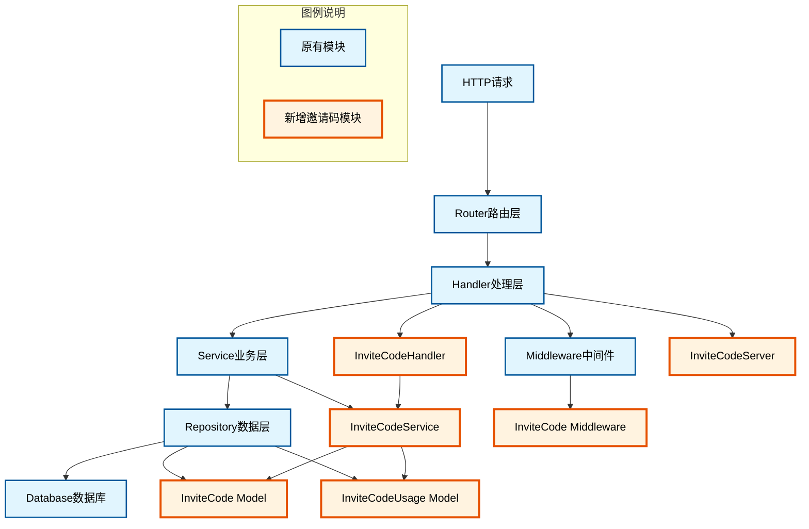
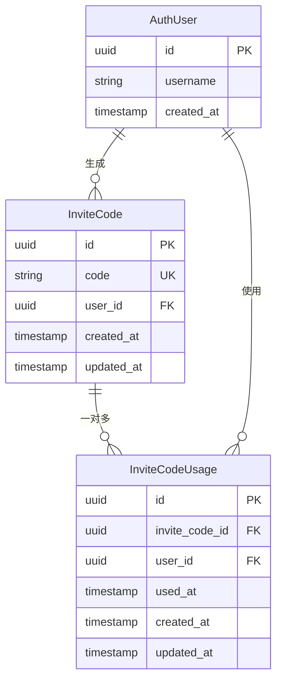
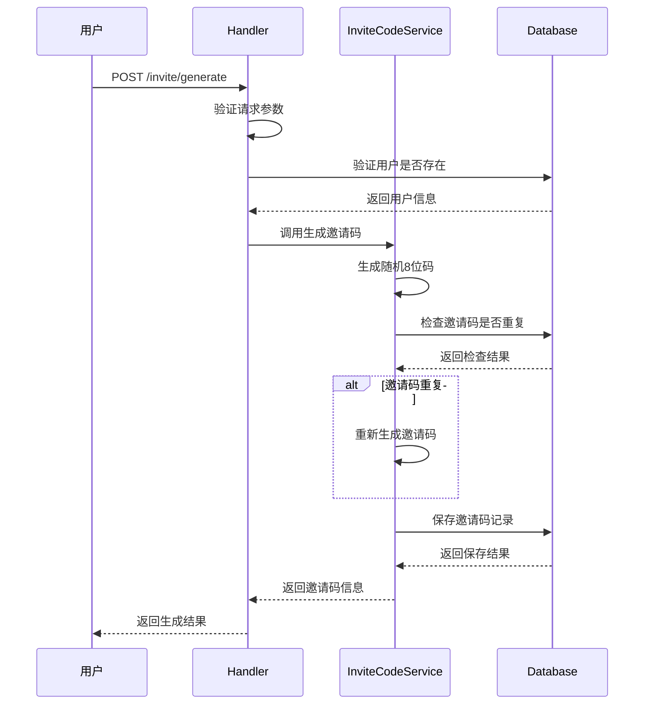
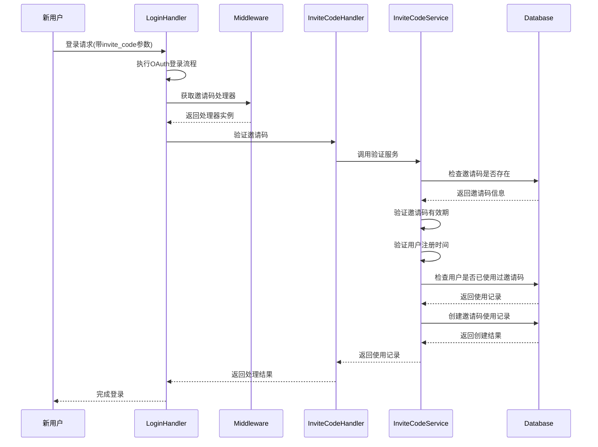

# 邀请码系统技术文档

## 概述

本文档描述了OIDC认证系统中新增的邀请码功能模块。该功能允许用户生成邀请码，新用户在登录时可以使用邀请码，系统会记录邀请关系并支持向外部服务上报邀请码使用事件。

## 功能需求

### 核心功能
1. **邀请码生成**：用户可以生成唯一的邀请码
2. **邀请码验证**：新用户登录时可以使用邀请码建立邀请关系
3. **使用记录追踪**：记录邀请码的使用情况和邀请关系
4. **API接口**：提供RESTful API管理邀请码

### 业务规则
- 邀请码长度：8位字符，包含大写字母和数字
- 邀请码有效期：30天
- 用户注册后可使用邀请码的有效期：1天
- 每个用户只能使用一次邀请码

## 系统架构

### 模块组成



### 模块分类详细说明

#### 🔵 原有模块（蓝色）
系统原有的核心架构组件，为OIDC认证系统的基础框架：
- **HTTP请求**：客户端发起的HTTP请求入口
- **Router路由层**：负责请求路由分发和中间件管理
- **Handler处理层**：处理具体的业务请求逻辑
- **Service业务层**：核心业务逻辑处理
- **Repository数据层**：数据访问和持久化操作
- **Database数据库**：数据存储层
- **Middleware中间件**：请求预处理和后处理逻辑

#### 🟠 新增邀请码专用模块（橙色）
专门为邀请码功能开发的业务模块：
- **InviteCodeHandler**：邀请码相关API请求处理器
- **InviteCodeServer**：邀请码服务端处理逻辑
- **InviteCodeService**：邀请码核心业务逻辑服务
- **InviteCode Model**：邀请码数据模型
- **InviteCodeUsage Model**：邀请码使用记录数据模型
- **InviteCode Middleware**：邀请码相关中间件处理

### 数据模型



## 核心流程

### 邀请码生成流程



### 邀请码使用流程



## API接口设计

### 生成邀请码

**请求**
```http
POST /oidc-auth/api/v1/invite/generate
Content-Type: application/json

{
    "user_id": "550e8400-e29b-41d4-a716-446655440000"
}
```

**响应**
```json
{
    "code": 200,
    "message": "Invite code generated successfully",
    "data": {
        "code": "ABC12345",
        "created_at": "2024-01-15 10:30:00"
    }
}
```

### 获取邀请码列表

**请求**
```http
GET /oidc-auth/api/v1/invite/list?user_id=550e8400-e29b-41d4-a716-446655440000
```

**响应**
```json
{
    "code": 200,
    "message": "Success",
    "data": {
        "codes": [
            {
                "id": "660e8400-e29b-41d4-a716-446655440001",
                "code": "ABC12345",
                "created_at": "2024-01-15 10:30:00"
            }
        ]
    }
}
```

### 登录时使用邀请码

**请求**
```http
GET /oidc-auth/api/v1/plugin/login?provider=casdoor&invite_code=ABC12345
```


## 数据库设计

### 邀请码表 (invite_codes)

| 字段 | 类型 | 约束 | 说明 |
|------|------|------|------|
| id | UUID | PRIMARY KEY | 主键 |
| code | VARCHAR(32) | UNIQUE, NOT NULL | 邀请码 |
| user_id | UUID | NOT NULL, INDEX | 生成用户ID |
| created_at | TIMESTAMPTZ | NOT NULL | 创建时间 |
| updated_at | TIMESTAMPTZ | NOT NULL | 更新时间 |

### 邀请码使用记录表 (invite_code_usages)

| 字段 | 类型 | 约束 | 说明 |
|------|------|------|------|
| id | UUID | PRIMARY KEY | 主键 |
| invite_code_id | UUID | NOT NULL, INDEX | 邀请码ID |
| user_id | UUID | NOT NULL, INDEX | 使用用户ID |
| used_at | TIMESTAMPTZ | NOT NULL | 使用时间 |
| created_at | TIMESTAMPTZ | NOT NULL | 创建时间 |
| updated_at | TIMESTAMPTZ | NOT NULL | 更新时间 |

### 索引设计

```sql
-- 邀请码表索引
CREATE UNIQUE INDEX idx_invite_codes_code ON invite_codes(code);
CREATE INDEX idx_invite_codes_user_id ON invite_codes(user_id);

-- 使用记录表索引
CREATE INDEX idx_invite_code_usages_invite_code_id ON invite_code_usages(invite_code_id);
CREATE INDEX idx_invite_code_usages_user_id ON invite_code_usages(user_id);
```

## 错误处理

### 常见错误码

| 错误码 | 说明 | 处理方式 |
|--------|------|----------|
| 400 | 请求参数错误 | 检查请求参数格式 |
| 404 | 用户或邀请码不存在 | 验证用户ID和邀请码 |
| 409 | 邀请码已被使用 | 提示用户邀请码已使用 |
| 410 | 邀请码已过期 | 提示用户邀请码过期 |
| 500 | 服务器内部错误 | 检查日志排查问题 |

### 业务异常处理

1. **邀请码重复**：自动重新生成
2. **邀请码过期**：返回明确错误信息
3. **用户已使用邀请码**：阻止重复使用
4. **数据库连接失败**：返回服务不可用错误

## 性能考虑

### 优化策略

1. **数据库索引**：为常用查询字段建立索引
2. **连接池**：使用数据库连接池提高并发性能
3. **缓存策略**：可考虑对热点邀请码进行缓存

### 监控指标

1. **邀请码生成速率**：监控邀请码生成的QPS
2. **邀请码使用率**：统计邀请码的使用情况
3. **响应时间**：监控API接口的响应时间
4. **错误率**：监控各类错误的发生频率

## 部署说明

### 环境要求

- Go 1.19+
- PostgreSQL 12+

### 配置步骤

1. 执行数据库迁移，创建相关表结构
2. 重启服务使配置生效
3. 验证API接口功能正常

### 监控部署

建议部署以下监控：
- 数据库性能监控
- API接口响应时间监控
- 错误日志告警

## 安全考虑

### 安全措施

1. **邀请码随机性**：使用加密安全的随机数生成器
2. **参数验证**：严格验证所有输入参数
3. **权限控制**：验证用户权限后才能生成邀请码
4. **防重放攻击**：邀请码只能使用一次
5. **日志记录**：记录所有关键操作的审计日志

### 数据保护

1. **敏感数据加密**：考虑对邀请码进行加密存储
2. **访问控制**：限制对邀请码数据的访问权限
3. **数据备份**：定期备份邀请码相关数据
4. **数据清理**：定期清理过期的邀请码数据

## 测试策略

### 单元测试

- 邀请码生成逻辑测试
- 邀请码验证逻辑测试
- 数据库操作测试

### 集成测试

- API接口测试
- 登录流程集成测试
- 错误处理测试

### 性能测试

- 并发邀请码生成测试
- 大量邀请码使用测试
- 数据库性能测试

## 版本历史

| 版本 | 日期 | 变更内容 |
|------|------|----------|
| 1.0.0 | 2024-01-15 | 初始版本，实现基础邀请码功能 |

## 相关文档

- [API参考文档](api-reference.md)
- [数据库设计文档](database-design.md)
- [认证流程文档](authentication-flow.md)
- [部署指南](deployment-guide.md)